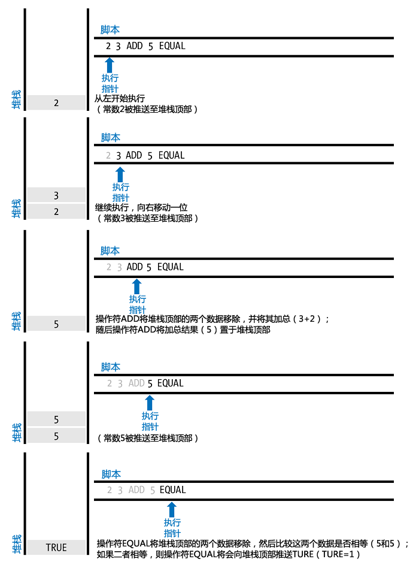
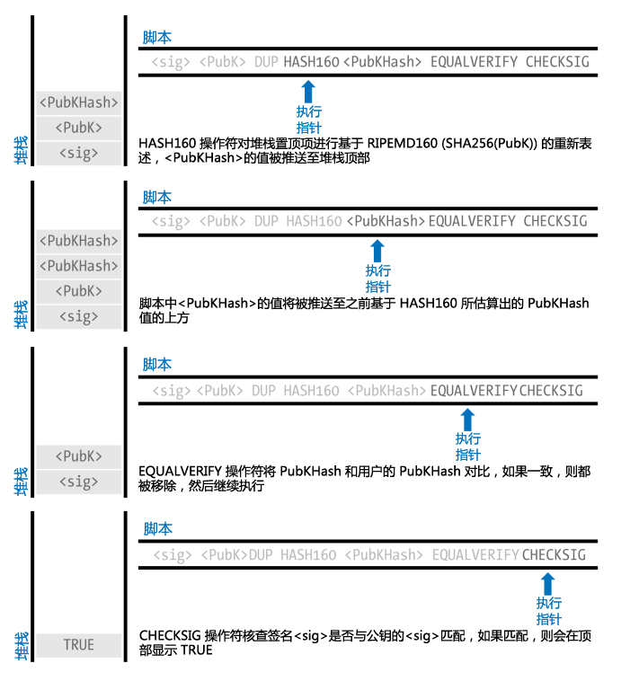

# 第五章 交易

## 5.1 简介

比特币交易是比特币系统中最重要的部分。根据比特币系统的设计原理，系统中任何其他的部分都是为了确保比特币交易可以被生成、能在比特币网络中得以传播和通过验证，并最终添加入全球比特币交易总账簿（比特币区块链）。比特币交易的本质是数据结构，这些数据结构中含有比特币交易参与者价值转移的相关信息。比特币区块链是全球复式记账总账簿，每个比特币交易都是在比特币区块链上的一个公开记录。

在这一章，我们将会剖析比特币交易的多种形式、所包含的信息、如何被创建、如何被验证以及如何成为所有比特币交易永久记录的一部分。

## 5.2 比特币交易的生命周期

一笔比特币交易的生命周期起始于它被创建的那一刻，也就是诞生（origination）。 随后，比特币交易会被一个或者多个签名加密，这些签名标志着对该交易指向的比特币资金的使用许可。接下来，比特币交易被广播到比特币网络中。在比特币网络中，每一个节点（比特币交易参与者）验证、并将交易在网络中进行广播，直到这笔交易被网络中大多数节点接收。最终，比特币交易被一个挖矿节点验证，并被添加到区块链上一个记录着许多比特币交易的区块中。

一笔比特币交易一旦被记录到区块链上并被足够多的后续区块确认，便成为比特币总账簿的一部分，并被所有比特币交易参与者认可为有效交易。于是，被这笔交易分配到一个新所有者名下的比特币资金可以在新的交易中被使用——这使得所有权链得以延伸且再次开启一个新的比特币交易生命周期。

### 5.2.1 创建比特币交易

将一笔比特币交易理解成纸质支票或许有助于加深我们对它的理解。与支票相似，一笔比特币交易其实是一个有着货币转移目的的工具，这个工具只有在交易被执行时才会在金融体系中体现，而且交易发起人并不一定是签署该笔交易的人。

比特币交易可以被任何人在线上或线下创建，即便创建这笔交易的人不是这个账户的授权签字人。比如，一个负责应付账款的柜员在处理应付票据时可能会需要CEO签名。相似地，这个负责应付账款的柜员可以创建比特币交易，然后让CEO对它进行数字签名，从而使之有效。一张支票是指定一个特定账户作为资金来源的，但是比特币交易指定以往的一笔交易作为其资金来源，而不是一个特定账户。

一旦一笔比特币交易被创建，它会被资金所有者（们）签名。如果它是合法创建并签名的，则该笔交易现在就是有效的，它包含了转移这笔资金所需要的所有信息。最终，有效的比特币交易必须能接入比特币网络，从而使之能被传送，直至抵达下一个登记在公共总账薄（区块链）的挖矿节点。

### 5.2.2 将比特币交易传送至比特币网络

首先，一笔交易需要传递至比特币网络，才能被传播，也才能加入区块链中。本质上，一笔比特币交易只是300到400字节的数据，而且它们必须被发送到成千上万个比特币节点中的任意一个。只要发送者能使用多于一个比特币节点来确保这笔交易被传播，那么发送者并不需要信任用来传播该笔交易的单一节点。相应地，这些节点不需要信任发送者，也不用建立发送者的“身份档案”。由于这笔交易是经过签名且不含任何机密信息、私钥或密码，因此它可被任何潜在的便利网络公开地传播。信用卡交易包含敏感信息，而且依赖加密网络连接完成信息传输，但比特币交易可在任意网络环境下被发送。只要这笔交易可以到达能将它广播到比特币网络的比特币节点，这笔交易是如何被传输至第一个节点的并不重要。

比特币交易因此可以通过未加密网络（例如WiFi、蓝牙、NFC、ChirP、条形码或者复制粘贴至一个网页表格）被发送到比特币网络。在一些极端情况下，一笔比特币交易可以通过封包无线电、卫星或短波、扩频或跳频以避免被侦测或阻塞通信的方式进行传输。一笔比特币交易甚至可被编为文字信息中的表情符号并被发表到在线论坛，或被发送成一条短信或一条Skype聊天信息。因为比特币将金钱变成了一种数据结构，所以在本质上是不可能阻止任何人创建并执行比特币交易的。

### 5.2.3 比特币交易在比特币网络中的传播

一旦一笔比特币交易被发送到任意一个连接至比特币网络的节点，这笔交易将会被该节点验证。如果交易被验证有效，该节点将会将这笔交易传播到这个节点所连接的其他节点；同时，交易发起者会收到一条表示交易成功的返回信息。如果这笔交易被验证为无效，这个节点会拒绝接受这笔交易且同时返回给交易发起者一条表示交易被拒绝的信息。

比特币网络是一个点对点网络，这意味着每一个比特币节点都连接到一些其他的比特币节点（这些其他的节点是在启动点对点协议时被发现的）。整个比特币网络形成了一个松散地连接、且没有固定拓扑或任何结构的“蛛网”——这使得所有节点的地位都是同等的。比特币交易相关信息（包括交易和区块）被传播——从每一个节点到它连接的其他节点。一笔刚通过验证且并被传递到比特币网络中任意节点的交易会被发送到三到四个相邻节点，而每一个相邻节点又会将交易发送到三至四个与它们相邻的节点。以此类推，在几秒钟之内，一笔有效的交易就会像指数级扩散的波一样在网络中传播，直到所有连接到网络的节点都接收到它。

比特币网络被设计为能高效且灵活地传递交易和区块至所有节点的模式，因而比特币网络能抵御入侵。为了避免垃圾信息的滥发、拒绝服务攻击或其他针对比特币系统的恶意攻击，每一个节点在传播每一笔交易之前均进行独立验证。 一个异常交易所能到达的节点不会超过一个。177页“交易的独立验证”一节将详细介绍决定比特币交易是否有效的原则。

## 5.3 交易结构

一笔比特币交易是一个含有输入值和输出值的数据结构，该数据结构植入了将一笔资金从初始点（输入值）转移至目标地址（输出值）的代码信息。比特币交易的输入值和输出值与账号或者身份信息无关。你应该将它们理解成一种被特定秘密信息锁定的一定数量的比特币。只有拥有者或知晓这个秘密信息的人可以解锁。一笔比特币交易包含一些字段，如表5-1所示。

**表5-1 交易结构**

|大小|字段|描述|   
|--|--|--|
|4字节|    版本|        明确这笔交易参照的规则|
|1-9字节|  输入计数器|  被包含的输入的数量|
|不定  |   输入   |     一个或多个交易输入|
|1-9字节 | 输出计数器 | 被包含的输入的数量|
|不定  |   输出    |    一个或多个交易输出|
|4字节   | 时钟时间  |  一个UNIX时间戳或区块号|

> ### 交易的锁定时间

>锁定时间定义了能被加到区块链里的最早的交易时间。在大多数交易里，它被设置成0，用来表示立即执行。如果锁定时间不是0并且小于5亿，就被视为区块高度，意指在这个指定的区块高度之前的交易没有被包含在这个区块链里。如果锁定时间大于5亿，则它被当作是一个Unix纪元时间戳（从1970年1月1日以来的秒数），并且在这个指定时点之前的交易没有被包含在这个区块链里。锁定时间的使用相当于将一张纸质支票的生效时间予以后延。

## 5.4 交易的输出和输入

比特币交易的基本单位是未经使用的一个交易输出，简称UTXO。UTXO是不能再分割、被所有者锁住或记录于区块链中的并被整个网络识别成货币单位的一定量的比特币货币。比特币网络监测着以百万为单位的所有可用的（未花费的）UTXO。当一个用户接收比特币时，金额被当作UTXO记录到区块链里。这样，一个用户的比特币会被当作UTXO分散到数百个交易和数百个区块中。实际上，并不存在储存比特币地址或账户余额的地点，只有被所有者锁住的、分散的UTXO。“一个用户的比特币余额”，这个概念是一个通过比特币钱包应用创建的派生之物。比特币钱包通过扫描区块链并聚合所有属于该用户的UTXO来计算该用户的余额。

>  
<br> 在比特币的世界里既没有账户，也没有余额，只有分散到区块链里的UTXO。

一个UTXO可以是一“聪”的任意倍。就像美元可以被分割成表示两位小数的“分”一样，比特币可以被分割成表示八位小数的“聪”。尽管UTXO可以是任意值，但只要它被创造出来了，就像不能被切成两半的硬币一样不可再分了。如果一个UTXO比一笔交易所需量大，它仍会被当作一个整体而消耗掉，但同时会在交易中生成零头。例如，你有20比特币的UTXO并且想支付1比特币，那么你的交易必须消耗掉整个20比特币的UTXO并且产生两个输出：一个是支付了1比特币给接收人，另一个是支付19比特币的找零到你的钱包。这样的话，大部分比特币交易都会产生找零。

想象一下，一位顾客要买1.5元的饮料。她掏出她的钱包并努力从所有硬币和钞票中找出一种组合来凑齐她要支付的1.5元。如果可能的话，她会选刚刚好的零钱（比如一张1元纸币和5个一毛硬币）或者是小面额的组合（比如3个五毛硬币）。如果都不行的话，她会用一张大面额的钞票，比如5元纸币。如果她把过多的钱，比如5元，给了商店老板，她会拿到3.5元的找零，并把找零放回她的钱包以供未来使用。

类似的，一笔比特币交易可以有任意数值，但必须从用户可用的UTXO中创建出来。用户不能再把UTXO进一步细分，就像不能把一元纸币撕开而继续当货币使用一样。用户的钱包应用通常会从用户可用的UTXO中选取多个可用的个体来拼凑出一个大于或等于一笔交易所需的比特币量。

就像现实生活中一样，比特币应用可以使用一些策略来满足付款需要：组合若干小的个体，算出准确的找零；或者使用一个比交易值大的个体然后进行找零。所有这些复杂的、由可支付的UTXO完成的组合，都是由用户的钱包自动完成，并不为用户所见。只有当你以编程方式用UTXO来构建原始交易时，这些才与你有关。

被交易消耗的UTXO被称为交易输入，由交易创建的UTXO被称为交易输出。通过这种方式，一定量的比特币价值在不同所有者之间转移，并在交易链中消耗和创建UTXO。一笔比特币交易通过使用所有者的签名来解锁UTXO，并通过使用新的所有者的比特币地址来锁定并创建UTXO。

对于输出和输入链来说，有一个例外，它是一种特殊的交易类型，称为Coinbase交易。这是每个区块中的首个交易。这种交易存在的原因是作为对挖矿的奖励而产生全新的可用于支付的比特币给“赢家”矿工。这也就是为什么比特币可以在挖矿过程中被创造出来，就像我们将在第八章中提及的那样。

>  
<br> 输入和输出，哪一个是先产生的呢？先有鸡还是先有蛋呢？严格来讲，先产生输出，因为可以创造新比特币的coinbase交易没有输入，但它可以无中生有地产生输出。

### 5.4.1 交易输出

每一笔比特币交易创造输出，输出都会被比特币账簿记录下来。几乎所有的输出（参见130页数据输出的“OP_RETURN”一节）创造可用于支付的一定数量的比特币，也就是UTXO。这些UTXO被整个网络识别，并且所有者可在未来的交易中使用它们。给某人发送比特币实际上是创造新的UTXO，注册到那个人的地址，并且能被他用于新的支付。

UTXO被每一个全节点比特币客户端在一个储存于内存中的数据库所追踪，该数据库也被称为“UTXO集”或者“UTXO池”。新的交易从UTXO集中消耗（支付）一个或多个输出。

交易输出包含两部分：

▷ 一定量的比特币，被命名为“聪”，是最小的比特币单位；
<br> 一个锁定脚本，也被当作是“障碍”，提出支付输出所必须被满足的条件以“锁住”这笔总额。

在前面的锁定脚本中提到的这个交易脚本语言会在后面121页的“交易脚本和脚本语言”一节中详细讨论。表5-2列出了交易输出的结构。

表5-2 交易输出结构

|尺寸|字段|说明|
|--|--|--|
|8个字节|总量|用聪表示的比特币值（10-8比特币）|
|1–9个字节（可变整数）|锁定脚本尺寸|用字节表示的后面的锁定脚本长度|
|变长|锁定脚本|一个定义了支付输出所需条件的脚本|

在例5-1中，我们使用blockchain.info应用程序接口来查找特定地址的UTXO。

**例5-1 一个调用blockchain.info应用程序接口来查找与一个地址有关的UTXO的脚本**

```
# 从blockchain API中得到未花费的输出

import json
import requests

# 样例地址
address = '1Dorian4RoXcnBv9hnQ4Y2C1an6NJ4UrjX'

# API网址是：https://blockchain.info/unspent?active=<address>
# 它返回一个JSON对象，其中包括一个包含着UTXO的“unspent_outputs”列表，就像这样：
#{      "unspent_outputs":[
    #{ 
#       tx_hash":"ebadfaa92f1fd29e2fe296eda702c48bd11ffd52313e986e99ddad9084062167",
#      "tx_index":51919767,
#      "tx_output_n": 1,
#      "script":"76a9148c7e252f8d64b0b6e313985915110fcfefcf4a2d88ac",
#      "value": 8000000,
#      "value_hex": "7a1200",
#      "confirmations":28691
#   },
# ...
#]} 

resp = requests.get('https://blockchain.info/unspent?active=%s' % address)
utxo_set = json.loads(resp.text)["unspent_outputs"]

for utxo in utxo_set:
    print "%s:%d - %ld Satoshis" % (utxo['tx_hash'], utxo['tx_output_n'], utxo['val 
ue']) 
```

运行脚本，我们将会得到“交易ID，冒号，特定UTXO的索引号，以及这个UTXO包含的聪的数额”的列表。在例5-2中，锁定脚本被省略了。

**例5-2 运行 get-utxo.py脚本**

```
$ python get-utxo.py
ebadfaa92f1fd29e2fe296eda702c48bd11ffd52313e986e99ddad9084062167:1 - 8000000 Satoshis
6596fd070679de96e405d52b51b8e1d644029108ec4cbfe451454486796a1ecf:0 - 16050000 Satoshis
74d788804e2aae10891d72753d1520da1206e6f4f20481cc1555b7f2cb44aca0:0 - 5000000 Satoshis
b2affea89ff82557c60d635a2a3137b8f88f12ecec85082f7d0a1f82ee203ac4:0 - 10000000 Satoshis
...
```

#### 支付条件（障碍）

交易输出把用聪表示的一定数量的比特币，和特定的定义了支付输出所必须被满足的条件的障碍，或者叫锁定脚本，关联到了一起。在大多数情况下，锁定脚本会把输出锁在一个特定的比特币地址上，从而把一定数量的比特币的所有权转移到新的所有者上。当Alice在Bob的咖啡店为一杯咖啡付款时，Alice的交易创造了0.015比特币的输出，在咖啡店的比特币地址上成为一种障碍，或者说是被锁在了咖啡店的比特币地址上。那0.015比特币输出被记录到区块链中，并且成为UTXO的一部分，也就是作为可用余额出现在Bob的钱包里。当Bob选择使用这笔款项进行支付时，他的交易会释放障碍，通过提供一个包含Bob私钥的解锁脚本来解锁输出。

### 5.4.2 交易输入

简单地说，交易输入是指向UTXO的指针。它们指向特定的UTXO，并被交易哈希和在区块链中记录UTXO的序列号作为参考。若想支付UTXO，一个交易的输入也需要包含一个解锁脚本，用来满足UTXO的支付条件。解锁脚本通常是一个签名，用来证明对于在锁定脚本中的比特币地址拥有所有权。

当用户付款时，他的钱包通过选择可用的UTXO来构造一笔交易。比如说，要支付0.015比特币，钱包应用会选择一个0.01 UTXO和一个0.005 UTXO，使用它们加在一起来得到想要的付款额。

在例5-3中，我们展示了一种贪心算法来为了得到特定的付款额而选择可用的UTXO。在例中，可用的UTXO被提供在一个常数数组中。但在实际中，可用的UTXO被一个远程过程调用比特币核心，或者被一个如例5-1中的第三方应用程序接口，来检索出来。

**例5-3 一个计算会被发送的比特币总量的脚本**


```
# 使用贪心算法从UTXO列表中选择输出。

from sys import argv 

class OutputInfo: 

    def __init__(self, tx_hash, tx_index, value): 
        self.tx_hash = tx_hash
        self.tx_index = tx_index
        self.value = value 

    def __repr__(self):
        return "<%s:%s with %s Satoshis>" % (self.tx_hash, self.tx_index, 
                                            self.value) 
                                            
# 为了发送，从未花费的输出列表中选出最优输出。
# 返回输出列表，并且把其他的改动发送到改变地址。
def select_outputs_greedy(unspent, min_value): 
    # 如果是空的话认为是失败了。
    if not unspent: return None 
    # 分割成两个列表。
    lessers = [utxo for utxo in unspent if utxo.value < min_value]     greaters = [utxo for utxo in unspent if utxo.value >= min_value] 
    key_func = lambda utxo: utxo.value
    if greaters: 
        # 非空。寻找最小的greater。
        min_greater = min(greaters)
        change = min_greater.value - min_value 
        return [min_greater], change 
    # 没有找到greaters。重新尝试若干更小的。
    # 从大到小排序。我们需要尽可能地使用最小的输入量。
    lessers.sort(key=key_func, reverse=True)
    result = []
    accum = 0
    for utxo in lessers: 
        result.append(utxo)
        accum += utxo.value
        if accum >= min_value: 
            change = accum - min_value
            return result, "Change: %d Satoshis" % change 
    # 没有找到。
    return None, 0 
    
def main(): 
    unspent = [ 
        OutputInfo("ebad
faa92f1fd29e2fe296eda702c48bd11ffd52313e986e99ddad9084062167", 1,  8000000),
        OutputIn
fo("6596fd070679de96e405d52b51b8e1d644029108ec4cbfe451454486796a1ecf", 0, 16050000),
        OutputInfo("b2af
fea89ff82557c60d635a2a3137b8f88f12ecec85082f7d0a1f82ee203ac4", 0,  10000000),
        OutputIn
fo("7dbc497969c7475e45d952c4a872e213fb15d45e5cd3473c386a71a1b0c136a1", 0, 25000000),
        OutputIn
fo("55ea01bd7e9afd3d3ab9790199e777d62a0709cf0725e80a7350fdb22d7b8ec6", 17, 5470541),
        OutputIn
fo("12b6a7934c1df821945ee9ee3b3326d07ca7a65fd6416ea44ce8c3db0c078c64", 0, 10000000),
        OutputIn
fo("7f42eda67921ee92eae5f79bd37c68c9cb859b899ce70dba68c48338857b7818", 0, 16100000),
    ] 
    
    if len(argv) > 1:
        target = long(argv[1]) 
    else:
        target = 55000000 
        
    print "For transaction amount %d Satoshis (%f bitcoin) use: " % (target, target/ 10.0**8) 
    print select_outputs_greedy(unspent, target) 
    
if __name__ == "__main__": 
    main() 
```

如果我们不使用参数运行select-utxo.py脚本，它会试图为一笔五千五百万聪（0.55比特币）的付款构造一组UTXO。如果你提供一个指定的付款额作为参数，脚本会选择UTXO来完成指定的付款额。在例5-4中，我们运行脚本来试着完成一笔0.5比特币，或者说是五千万聪的付款。

**例5-4 运行select-utxo.py**

```
$ python select-utxo.py 50000000
For transaction amount 50000000 Satoshis (0.500000 bitcoin) use:
([<7dbc497969c7475e45d952c4a872e213fb15d45e5cd3473c386a71a1b0c136a1:0 with 25000000
Satoshis>, <7f42eda67921ee92eae5f79bd37c68c9cb859b899ce70dba68c48338857b7818:0 with 16100000 Satoshis>,
<6596fd070679de96e405d52b51b8e1d644029108ec4cbfe451454486796a1ecf:0 with 16050000 Satoshis>], 'Change: 7150000 Satoshis')
```

一旦UTXO被选中，钱包会为每个UTXO生成包含签名的解锁脚本，由此让它们变得可以通过满足锁定脚本的条件来被支付。钱包把这些UTXO作为参考，并且连同解锁脚本一起作为输入加到交易中。表5-3展示了交易输入的结构。

**表5-3 交易输入的结构**

|尺寸|字段|说明|
|--|--|--|
|32个字节|交易|指向交易包含的被花费的UTXO的哈希指针|
|4个字节|输出索引|被花费的UTXO的索引号，第一个是0|
|1–9个字节（可变整数）|解锁脚本尺寸|用字节表示的后面的解锁脚本长度|
|变长|解锁脚本|一个达到UTXO锁定脚本中的条件的脚本|
|4个字节|序列号|目前未被使用的交易替换功能，设成0xFFFFFFFF|

序列号是用来覆盖在交易锁定时间之前失效的交易，这是一项目前没有在比特币中用到的功能。大多数交易把这个值设置成最大的整数（0xFFFFFFFF）并且被比特币网络忽略。如果一次交易有非零的锁定时间，那么它至少需要有一个序列号比0xFFFFFFFF低的输入来激活锁定时间。

### 5.4.3 交易费

大多数交易包含交易费，这是为了在网络安全方面给比特币矿工一种补偿。在第8章中，对于挖矿、费用和矿工得到的奖励，有更详细的讨论。这一节解释交易费是如何被包含在日常交易中的。大多数钱包自动计算并计入交易费。但是，如果你编程构造交易，或者使用命令行接口，你必须手动计算并计入这些费用。

交易费可当作是为了包含（挖矿）一笔交易到下一个区块中的一种鼓励，也可当作是对于欺诈交易和任何种类的系统滥用，在每一笔交易上通过征收一笔小成本的税而造成的一种妨碍。交易费被挖出这个区块的矿工得到，并且记录在这个交易的区块链中。

交易费基于交易的尺寸，用千字节来计算，而不是比特币的价值。总的来说，交易费基于市场所设置，生效于比特币网络中。矿工依据许多不同的标准，按重要性对交易进行排序，这包括费用，并且甚至可能在某种特定情况下免费处理交易。交易费影响处理优先级，这意味着有足够费用的交易会更可能地被包含在下一个挖出的区块中；与此同时，交易费不足或者没有交易费的交易可能会被推迟，基于尽力而为的原则在几个区块之后被处理，甚至可能根本不被处理。交易费不是强制的，而且没有交易费的交易也许最终会被处理，但是，包含交易费将提高处理优先级。

随着时间的过去，交易费的计算方式和交易费在交易优先级上的影响一直在发展。起初，交易费是网络中的一个固定常数。渐渐地，交易费的结构被放宽了，以便被市场基于网络容量和交易量而强制影响。目前最小交易费被固定在每千字节0.0001比特币，或者说是每千字节万分之一比特币，最近一次改变是从千分之一比特币减少到这个数值的。大多数交易少于一千字节，但是那些包含多个输入和输出的交易尺寸可能更大。在未来的比特币协议修订版中，钱包应用预计会使用统计学分析，基于最近的几笔交易的平均费用，来计算最恰当的费用并附在交易上。

目前矿工使用的，对包含在一个区块中的交易，基于它们的费用划分优先顺序的算法，在第8章有详细解释。

### 5.4.4 把交易费加到交易中

交易的数据结构没有交易费的字段。相反地，交易费通过所有输入的总和，以及所有输出的总和之间的差来表示。从所有输入中扣掉所有输出之后的多余的量会被矿工收集走。

交易费被作为输入减输出的余量：

`交易费 = 求和（所有输入） - 求和（所有输出）`

对于交易来说，这是一个很让人摸不着头脑的元素，但又是很重要的问题。因为如果你要构造你自己的交易，你必须确认你没有疏忽地包含了一笔少于输入的、量非常大的费用。这意味着你必须计算所有的输入，如果必要的话进行找零，不然的话，结果就是你给了矿工一笔可观的劳动费！

举例来说，如果你消耗了一个20比特币的UTXO来完成1比特币的付款，你必须包含一笔19比特币的找零回到你的钱包。否则，那剩下的19比特币会被当作交易费，并且会被挖出你的交易到一个区块中的矿工收走。尽管你会受到高优先级的处理，并且让一个矿工喜出望外，但这很可能不是你想要的。

>  
<br> 如果你忘记了在手动构造的交易中增加找零的输出，系统会把找零当作交易费来处理。“不用找了！”也许不是你想要的结果。

让我们来看看在实际中它如何工作，重温一下Alice在咖啡店的交易。Alice想为咖啡支付0.015比特币。为了确保这笔交易能立即被处理，Alice想支付一笔交易费，比如说0.001。这意味着总交易成本会变成0.016。因此她的钱包需要凑齐0.016或更多的UTXO。如果需要，还要加上找零。我们假设他的钱包有一个0.2比特币的UTXO可用。他的钱包就会消耗掉这个UTXO，创造一个新的0.015的输出给Bob的咖啡店，另一个0.184比特币的输出作为找零回到Alice拥有的钱包，并留下未分配的0.001比特币内含在交易中。

现在让我们换个例子。Eugenia，我们在菲律宾的儿童募捐项目主管，完成了一次为孩子购买教材的筹款活动。她在世界范围内接收到了好几千个小数额的捐款，总额是50比特币。所以她的钱包塞满了非常小的UTXO。现在她想用比特币从本地的一家出版商购买几百本的教材。

现在Eugenia的钱包应用想要构造一个单笔大额付款交易，它必须从可用的、由很多小数额构成的大的UTXO集合中寻求钱币来源。这意味着交易的结果是从上百个小数额的UTXO中作为输入，但只有一个输出用来付给出版商。输入数量这么巨大的交易会比一千字节要大，也许总尺寸会达到两至三千字节。结果是它需要更高的交易费来满足0.0001比特币的网络费。

Eugenia的钱包应用会通过测量交易的大小，乘以每千字节需要的交易费，来计算适当的交易费。很多钱包会通过多付交易费的方式来确保大交易被立即处理。高交易费不仅是因为Eugenia付的钱很多，还因为她的交易很复杂并且尺寸很大——交易费是与参加交易的比特币值无关的。

### 5.5 交易链条和孤立交易

正如我们之前所看到的那样，交易形成一条链，这条链的形式是一笔交易消耗了先前的交易（父交易）的输出，并为随后的交易（子交易）创造了输出。有的时候组成整个链条的所有交易依赖于他们自己——比如父交易、子交易和孙交易——而他们又被同时创造出来，来满足复杂交易的工作流程。这需要在一个交易的父交易被签名之前，有一个合法的子交易被签名。举个例子，这是CoinJoin交易使用的一项技术，这项技术可以让多方同时加入交易，从而保护他们的隐私。

当一条交易链被整个网络传送时，他们并不能总是按照相同的顺序到达目的地。有时，子交易在父交易之前到达。在这种情况下，节点会首先收到一个子交易，而不能找到他参考的父交易。节点不会立即抛弃这个子交易，而是放到一个临时池中，并等着接收它的父交易，与此同时广播这个子交易给其他节点。没有父交易的交易池被称作孤立交易池。一旦接收到了父交易，所有与这个父交易创建的UTXO有关的孤块会从池中释放出来，递归地重新验证，然后整条交易链就会被交易池包括进去，并等待着被区块所挖走。交易链可以是任意长度并且可以被任意数量的批次同时传走。在孤立池中保留孤块的机制保证了其他合法的交易不会只是因为父交易被耽误了而被抛弃，并且无论接收顺序，最终整个链会以正确的顺序重新构造出来。

内存中储存的孤立交易数量是有限制的，这是为了防止针对比特币节点的拒绝服务攻击（DoS）。这个限制被定义在比特币涉及到的客户端的源代码中的`MAX_ORPHAN_TRANSACTIONS`。如果池中的孤立交易数量达到了`MAX_ORPHAN_TRANSACTIONS`，一个或多个的、被随机选出的孤立交易会被池抛弃，直到池的大小回到限制以内。

### 5.6 比特币交易脚本和脚本语言

比特币客户端通过执行一个用类Forth脚本语言编写的脚本验证比特币交易。锁定脚本被写入UTXO，同时它往往包含一个用同种脚本语言编写的签名。当一笔比特币交易被验证时，每一个输入值中的解锁脚本被与其对应的锁定脚本同时（互不干扰地）执行，从而查看这笔交易是否满足使用条件。

如今，大多数经比特币网络处理的交易是以“Alice付给Bob”的形式存在的。同时，它们是以一种称为“P2PKH”（Pay-to-Public-Key-Hash）脚本为基础的。然而，通过使用脚本来锁定输出和解锁输入意味着通过使用编程语言，比特币交易可以包含无限数量的条件。当然，比特币交易并不限于“Alice付给Bob” 的形式和模式。

这只是这个脚本语言可以表达的可能性的冰山一角。在这一节，我们将会全面展示比特币交易脚本语言的各个组成部分；同时，我们也会演示如何使用它去表达复杂的使用条件以及解锁脚本如何去满足这些花费条件。

>  
<br>比特币交易验证并不基于一个不变的模式，而是通过运行脚本语言来实现。这种语言可以表达出多到数不尽的条件变种。这也是比特币作为一种“可编程的货币”所拥有的权力。

### 5.6.1 脚本创建（锁定与解锁）

比特币的交易验证引擎依赖于两类脚本来验证比特币交易：一个锁定脚本和一个解锁脚本。

锁定脚本是一个放在一个输出值上的“障碍”，同时它明确了今后花费这笔输出的条件。由于锁定脚本往往含有一个公钥（即比特币地址），在历史上它曾被称作一个脚本公钥代码。由于认识到这种脚本技术存在着更为宽泛的可能性，在本书中，我们将它称为一个“锁定脚本”。在大多数比特币应用源代码中，脚本公钥代码便是我们所说的锁定脚本。

解锁脚本是一个“解决”或满足被锁定脚本在一个输出上设定的花费条件的脚本，同时它将允许输出被消费。解锁脚本是每一笔比特币交易输出的一部分，而且往往含有一个被用户的比特币钱包（通过用户的私钥）生成的数字签名。由于解锁脚本常常包含一个数字签名，因此它曾被称作`ScriptSig`。在大多数比特币应用的源代码中，`ScriptSig`便是我们所说的解锁脚本。考虑到更宽泛的锁定脚本要求，在本书中，我们将它称为“解锁脚本”。但并非所有解锁脚本都一定会包含签名。

每一个比特币客户端会通过同时执行锁定和解锁脚本来验证一笔交易。对于比特币交易中的每一个输入，验证软件会先检索输入所指向的UTXO。这个UTXO包含一个定义了花费条件的锁定脚本。接下来，验证软件会读取试图花费这个UTXO的输入中所包含的解锁脚本，并执行这两个脚本。

在先前的比特币客户端中，解锁和锁定脚本是以连锁的形式存在的，并且是被依次执行的。出于安全因素考虑，在2010年比特币开发者们修改了这个特性——因为存在“允许异常解锁脚本推送数据入栈并且污染锁定脚本”的漏洞。在当今的比特币世界中，这两个脚本是随着堆栈的传递被分别执行的，后续将会详细介绍。

首先，使用堆栈执行引擎执行解锁脚本。如果解锁脚本在执行过程中未报错（没有悬空操作符），主堆栈（非其它堆栈）将被复制，然后脚本将被执行。如果采用从解锁脚本处复制而来的数据执行锁定脚本的结果为真，那么解锁脚本就成功地满足了锁定脚本所设置的条件，因而，该输入是一个能使用该UTXO的有效授权。如果在执行完组合脚本后的结果不是真，那么输入就不是有效的，因为它并未能满足UTXO中所设置的使用该笔资金的条件。注意，UTXO是永久性地记录在区块链中的，因此它不会因一笔新交易所发起的无效尝试而变化或受影响。只有一笔有效的能准确满足UTXO条件的交易才会导致UTXO被标记为“已使用”，然后从有效的（未使用）UTXO集中所移除。

图5-1是最为常见类型的比特币交易（向公钥哈希进行一笔支付）的解锁和锁定脚本样本，该样本展示了在脚本验证之前将解锁脚本和锁定脚本串联而成的组合脚本。

>  
<br> 图5-1


### 5.6.2 脚本语言

比特币交易脚本语言，也成为脚本，是一种基于逆波兰表示法的基于堆栈的执行语言。如果这让您听起来似乎在胡言乱语，很有可能是您没学习过1960年的编程语言的缘故。脚本是一种非常简单的语言，这种语言被设计为能在有限的硬件上执行，这些硬件类似简单的嵌入式设备，如手持计算器。它仅需最少的处理即可，而且不能做许多现代编程语言可以做的事情。当涉及可编程的钱时，这是它的一个基于深思熟虑的安全特性。

比特币脚本语言被称为基于堆栈语言，因为它使用的数据结构被称为堆栈。堆栈是一个非常简单的数据结构，它可以被理解成为一堆卡片。一个堆栈允许两类操作：推送和弹出。推送是在堆栈顶部增加一个项目，弹出则是从堆栈顶部移除一个项目。

脚本语言通过从左至右地处理每个项目的方式执行脚本。数字（常数）被推送至堆栈，操作符向堆栈推送（或移除）一个或多个参数，对它们进行处理，甚至可能会向堆栈推送一个结果。例如，OP_ADD将从堆栈移除两个项目，将二者相加，然后再将二者相加之和推送到堆栈。

条件操作符评估一项条件，产生一个真或假的结果。例如，OP_EQUAL从堆栈移除两个项目，假如二者相等则推送真（表示为1），假如二者不等则推送为假（表示为0）。比特币交易脚本常含条件操作符，当一笔交易有效时，就会产生真的结果。

>  
<br> 图5-2

在图5-2中，脚本`2 3 OP_ADD 5 OP_EQUAL`演示了算术加法操作符`OP_ADD`，该操作符将两个数字相加，然后把结果推送到堆栈，`OP_EQUAL`是验算之前的两数之和是否等于`5`。为了简化起见，前缀`OP_`在一步步的演示示例过程中将被省略。

以下是一个稍微有些复杂的脚本，它用于计算`2+7-3+1`。注意，当脚本包含多个操作符时，堆栈允许一个操作符的结果作用于下一个操作符。

`2 7 OP_ADD 3 OP_SUB 1 OP_ADD 7 OP_EQUAL`

请试着用纸笔自行演算脚本，当脚本执行完毕时，你会在堆栈得到正确的结果。

虽然大多数的解锁脚本都指向一个比特币地址或公钥，因而如果想要使用资金则需验证所有权，但脚本本身并不需要如此的复杂。任何解锁和锁定脚本的组合如果结果为真，则为有效。前面被我们用于说明脚本语言的简单算术运算同样也是一个有效的锁定脚本，该脚本能用于锁定交易输出。

使用部分算数运算示例脚本作用锁定脚本：

`3 OP_ADD 5 OP_EQUAL`

该脚本能被以解锁脚本为输入的一笔交易所满足，解锁脚本为：

`2`

验证软件将锁定和解锁脚本组合起来：

`2 3 OP_ADD 5 OP_EQUAL`

正如在图5-2中所看到的，当脚本被执行时，结果是OP_TRUE，从而使得交易有效。不仅该笔交易的输出锁定脚本有效，同时UTXO也能被任何知晓这个运算技巧（知道是数字2）的人所使用。

>  
<br> 如果堆栈顶部的结果显示为真（标记为{0×01}），即为任何非零值或脚本执行后堆栈为空情形，则交易有效。如果堆栈顶部的结果显示为假（0字节空值，标记为{}）或脚本执行被操作符禁止，如OP_VERIFY、OP_RETURN，或有条件终止如OP_ENDIF，则交易无效。详见附录A。

### 5.6.3 图灵非完备性

比特币脚本语言包含许多操作，但都故意限定为一种重要的方式——没有循环或者复杂流控制功能以外的其他条件的流控制。这样就保证了脚本语言的图灵非完备性，这意味着脚本的复杂性有限，交易可执行的次数也可预见。脚本并不是一种通用语言，施加的这些限制确保该语言不被用于创造无限循环或其它类型的逻辑炸弹，这样的炸弹可以植入在一笔交易中，通过引起拒绝服务的方式攻击比特币网络。受限制的语言能防止交易激活机制被人当作薄弱环节而加以利用。

### 5.6.4 非主权验证

比特币交易脚本语言是无国家主权的，没有国家能凌驾于脚本之上，也没有国家会在脚本被执行后对其进行保存。所以需要执行脚本的所有信息都已包含在脚本中。可以预见的是，一个脚本能在任何系统上以相同的方式执行。如果您的系统对一个脚本进行验证，可以确信的是每一个比特币网络中的其他系统也将对其进行验证，这意味着一个有效的交易对每个人而言都是有效的，而且每一个人都明白这一点。这种对于结果的可预见性是比特币系统的一项重要良性特征。

## 5.7 标准交易

在比特币最初几年的发展过程中，开发者对可以经由客户端进行操作的脚本类型设置了一些限制。这些限制被编译为一个Standard（）函数，该函数定义了五种类型的标准交易。这些限制都是临时性的，当您阅读本书时或许已经更新。截至目前，五种标准交易脚本是仅有的被客户端和大多数运行客户端的矿工们所接受的脚本。虽然创设一个非标准交易（脚本类型非标准化）是有可能的，但前提是必须能找到一个不遵循标准而且能将该非标准交易纳入区块的矿工。

通过检索比特币核心客户端源代码，可以看到当前有哪些交易脚本是被认可的。

五大标准脚本分别为P2PKH、P2PK、MS（限15个密钥）、P2SH和OP_Return，后文将详细介绍这五大脚本。

### 5.7.1 P2PKH（Pay-to-Public-Key-Hash）

比特币网络上的大多数交易都是P2PKH交易，此类交易都含有一个锁定脚本，该脚本由公钥哈希实现阻止输出功能，公钥哈希即为广为人知的比特币地址。由P2PKH脚本锁定的输出可以通过键入公钥和由相应私钥创设的数字签名得以解锁。

例如，我们可以再次回顾一下Alice向Bob咖啡馆支付的案例。Alice下达了向Bob咖啡馆的比特币地址支付0.015比特币的支付指令，该笔交易的输出内容为以下形式的锁定脚本：

`OP_DUP OP_HASH160 <Cafe Public Key Hash> OP_EQUAL OP_CHECKSIG`

脚本中的`Cafe Public Key Hash`即为咖啡馆的比特币地址，但这个地址不是基于Base58Check编码的。事实上，大多数比特币地址都显示为十六进制码，而不是大家所熟知的以1开头的基于Bsase58Check编码的比特币地址。

锁定脚本的解锁版脚本是：

`<Cafe Signature> <Cafe Public Key>`

将两个脚本结合起来可以形成如下有效组合脚本：

```
<Cafe Signature> <Cafe Public Key> OP_DUP OP_HASH160
<Cafe Public Key Hash> OP_EQUAL OP_CHECKSIG
```

只有当解锁版脚本与锁定版脚本的设定条件相匹配时，执行组合有效脚本时才会显示结果为真（Ture）。即只有当解锁脚本得到了咖啡馆的有效签名，交易执行结果才会被通过（结果为真），该有效签名是从与公钥哈希相匹配的咖啡馆的私钥中所获取的。

图5-3和图5-4（分两部分）显示了组合脚本一步步检验交易有效性的过程。

>  
<br> 图5-3

>  
<br> 图5-4

### 5.7.2 P2PK（Pay-to-Public-Key）

与P2PKH相比，P2PK模式更为简单。与P2PKH模式含有公钥哈希的模式不同，在P2PK脚本模式中，公钥本身已经存储在锁定脚本中，而且代码长度也更短。P2PKH是由Satoshi创建的，主要目的一方面为使比特币地址更简短，另一方面也使之更方便使用。P2PK目前在Coinbase交易中最为常见，Coinbase交易由老的采矿软件产生，目前还没更新至P2PKH。

P2PK锁定版脚本形式如下：

`<Public Key A> OP_CHECKSIG`

用于解锁的脚本是一个简单签名：

`<Signature from Private Key A>`

经由交易验证软件确认的组合脚本为：

`<Signature from Private Key A> <Public Key A> OP_CHECKSIG`

该脚本只是CHECKSIG操作符的简单调用，该操作主要是为了验证签名是否正确，如果正确，则返回为真（Ture）。

### 5.7.3 多重签名

多重签名脚本设置了这样一个条件，假如记录在脚本中的公钥个数为N，则至少需提供其中的M个公钥才可以解锁。这也被称为M-N组合，其中，N是记录在脚本中的公钥总个数，M是使得多重签名生效的公钥数阀值（最少数目）。例如，对于一个2-3多重签名组合而言，存档公钥数为3个，至少同时使用其中2个或者2个以上的公钥时，才能生成激活交易的签名，通过验证后才可使用这笔资金。最初，标准多重签名脚本的最大存档公钥数被限定为15个，这意味着可采用1-1乃至15-15的任意多重签名组合，或者组合的组合来激活交易。15个存档公钥数的限制也许在本书出版时已有所增加，读者通过检索Standard（）函数可以获得最新存档公钥数上限值的相关信息。

通用的M-N多重签名锁定脚本形式为：

`M <Public Key 1> <Public Key 2> ... <Public Key N> N OP_CHECKMULTISIG`

其中，N是存档公钥总数，M是要求激活交易的最少公钥数。

2-3多重签名条件：

`2 <Public Key A> <Public Key B> <Public Key C> 3 OP_CHECKMULTISIG`

上述锁定脚本可由含有签名和公钥的脚本予以解锁：

`OP_0 <Signature B> <Signature C>`

或者由3个存档公钥中的任意2个相一致的私钥签名组合予以解锁。

>  
<br> 之所以要加上前缀OP_0，是因为最早的CHECKMULTISIG在处理含有多个项目的过程中有个小漏洞，CHECKMULTISIG会自动忽略这个前缀，它只是占位符而已。

两个脚本组合将形成一个验证脚本：

`OP_0 <Signature B> <Signature C> 2 <Public Key A> <Public Key B> <Public Key C> 3 OP_CHECKMULTISIG`

当执行时，只有当未解锁版脚本与解锁脚本设置条件相匹配时，组合脚本才显示得到结果为真（Ture）。上述例子中相应的设置条件即为未解锁脚本是否含有与3个公钥中的任意2个相一致的私钥的有效签名。

### 5.7.4 数据输出（OP_RETURN操作符）

比特币的分发和时间戳账户机制（也即区块链），其潜在运用将大大超越支付领域。许多开发者试图充分发挥交易脚本语言的安全性和可恢复性优势，将其运用于电子公证服务、证券认证和智能协议等领域。比特币脚本语言的早期运用主要包括在区块链上创造出交易输出。例如，为文件记录电子指纹，则任何人都可以通过该机制在特定的日期建立关于文档存在性的证明。

运用比特币区块链存储与比特币支付不相关数据的做法是一个有争议的话题。许多开发者认为其有滥用的嫌疑，因而试图予以阻止。另一些开发者则将之视为区块链技术强大功能的有力证明，从而试图给予大力支持。那些反对非支付相关应用的开发者认为这样做将引致“区块链膨胀”，因为所有的区块链节点都将以消耗磁盘存储空间为成本，负担存储此类数据的任务。更为严重的是，此类交易仅将比特币地址当作自由组合的20个字节而使用，进而会产生不能用于交易的UTXO。因为比特币地址只是被当作数据使用，并不与私钥相匹配，所以会导致UTXO不能被用于交易，因而是一种伪支付行为。这样的做法将使得内存中的UTXO不断增加，而且这些不能被用于交易的数据同样也不能被移除，因此比特币节点将永久性地担负这些数据，这无疑是代价高昂的。

在0.9版的比特币核心客户端上，通过采用`OP_Return`操作符最终实现了妥协。`OP_Return`允许开发者在交易输出上增加40字节的非交易数据。然后，与伪交易型的UTXO不同，`OP_Return`创造了一种明确的可复查的非交易型输出，此类数据无需存储于UTXO集。`OP_Return`输出被记录在区块链上，它们会消耗磁盘空间，也会导致区块链规模的增加，但它们不存储在UTXO集中，因此也不会使得UTXO内存膨胀，更不会以消耗代价高昂的内存为代价使全节点都不堪重负。

`OP_RETURN`脚本的样式：

`OP_RETURN <data>`

“data”部分被限制为40字节，且多以哈希方式呈现，如32字节的SHA256算法输出。许多应用都在其前面加上前缀以辅助认定。例如，电子公正服务的证明材料采用8个字节的前缀“DOCPROOF”，在十六进制算法中，相应的ASCII码为`44f4350524f4f46`。

请记住`OP_RETURN`不涉及可用于支付的解锁脚本的特点，`OP_RETURN`不能使用其输出中所锁定的资金，因此它也就没有必要记录在蕴含潜在成本的UTXO集中，所以`OP_RETURN`实际是没有成本的。`OP_RETURN`常为一个金额为0的比特币输出，因为任何与该输出相对应的比特币都会永久消失。假如一笔`OP_RETURN`遇到脚本验证软件，它将立即导致验证脚本和标记交易的行为无效。如果你碰巧将`OP_RETURN`的输出作为另一笔交易的输入，则该交易是无效的。

一笔标准交易（通过了`isStandard()`函数检验的）只能有一个`OP_RETURN`输出。但是单个`OP_RETURN`输出能与任意类型的输出交易进行组合。

### 5.7.5 P2SH（Pay-to-Script-Hash）

P2SH在2012年被作为一种新型、强大、且能大大简化复杂交易脚本的交易类型而引入。为进一步解释P2SH的必要性，让我们先看一个实际的例子。

在第一章中，我们曾介绍过Mohammed，一个迪拜的电子产品进口商。Mohammed的公司采用比特币多重签名作为其公司会计账簿记账要求。多重签名脚本是比特币高级脚本最为常见的运用之一，是一种具有相当大影响力的脚本。针对所有的顾客支付（即应收账款），Mohammed的公司要求采用多重签名交易。基于多重签名机制，顾客的任何支付都需要至少两个签名才能解锁，一个来自Mohammed，另一个来自其合伙人或拥有备份钥匙的代理人。这样的多重签名机制能为公司治理提供管控便利，同时也能有效防范盗窃、挪用和遗失。

最终的脚本非常长：

```
2 <Mohammed's Public Key> <Partner1 Public Key> <Partner2 Public Key> <Partner3 Public Key> <Attorney Public Key> 5 OP_CHECKMULTISIG
```

虽然多重签名十分强大，但其使用起来还是多有不便。基于之前的脚本，Mohammed必须在客户付款前将该脚本发送给每一位客户，而每一位顾客也必须使用特制的能产生客户交易脚本的比特币钱包软件，每位顾客还得学会如何利用脚本来完成交易。此外，由于脚本可能包含特别长的公钥，最终的交易脚本可能是最初交易脚本长度的5倍之多。额外长度的脚本将给客户造成费用负担。最后，一个长的交易脚本将一直记录在所有节点的随机存储器的UTXO集中，直到该笔资金被使用。所有这些都使得在实际交易中采用复杂输出脚本显得困难重重。

P2SH正是为了解决这一实际难题而被引入的，它旨在使复杂脚本的运用能与直接向比特币地址支付一样简单。在P2SH支付中，复杂的锁定脚本被电子指纹所取代，电子指纹为密码学哈希。当一笔交易试图支付UTXO时，要解锁支付脚本，它必须含有与哈希相匹配的脚本。P2SH的含义是，向与该哈希匹配的脚本支付，当输出被支付时，该脚本将在后续呈现。

在P2SH交易中，锁定脚本由哈希取代，哈希指代的是赎回脚本。因为它在系统中是在赎回时出现而不是以锁定脚本模式出现。表5-4列示了非P2SH脚本，表5-5列示了P2SH脚本。

**表5-4 不含P2SH的复杂脚本**

|Locking Script| 2 PubKey1 PubKey2 PubKey3 PubKey4 PubKey5 5 OP_CHECKMULTISIG|
|--|--|
|Unlocking Script|Sig1 Sig2|

**表5-5 P2SH复杂脚本**

|Redeem |Script 2 PubKey1 PubKey2 PubKey3 PubKey4 PubKey5 5 OP_CHECKMULTISIG|
|--|--|
| **Locking Script** | **OP_HASH160 <20-byte hash of redeem script> OP_EQUAL** |
| **Unlocking Script** | **Sig1 Sig2 redeem script** |

正如你在表中所看到的，在P2SH中，出现了花费该笔支出（赎回脚本）条件的复杂脚本，而这在锁定脚本中并未出现。取而代之，在锁定脚本中，只出现了哈希，而赎回脚本则在稍后输出被支付时才作为解锁脚本的一部分而出现。

让我们再看下Mohammed公司的例子，复杂的多重签名脚本和相应的P2SH脚本。

首先，Mohammed公司对所有顾客订单采用多重签名脚本：

`2 <Mohammed's Public Key> <Partner1 Public Key> <Partner2 Public Key> <Partner3 Public Key> <Attorney Public Key> 5 OP_CHECKMULTISIG`

如果占位符由实际的公钥（以04开头的520字节）替代，你将会看到的脚本会非常地长：

```
2
04C16B8698A9ABF84250A7C3EA7EE-
DEF9897D1C8C6ADF47F06CF73370D74DCCA01CDCA79DCC5C395D7EEC6984D83F1F50C900A24DD47F569FD4193AF5DE762C58704A2192968D8655D6A935BEAF2CA23E3FB87A3495E7AF308EDF08DAC3C1FCBFC2C75B4B0F4D0B1B70CD2423657738C0C2B1D5CE65C97D78D0E34224858008E8B49047E63248B75DB7379BE9CDA8CE5751D16485F431E46117B9D0C1837C9D5737812F393DA7D4420D7E1A9162F0279CFC10F1E8E8F3020DECDBC3C0DD389D99779650421D65CBD7149B255382ED7F78E946580657EE6FDA162A187543A9D85BAAA93A4AB3A8F044DA-
DA618D087227440645ABE8A35DA8C5B73997AD343BE5C2AFD94A5043752580AFA1EC-
ED3C68D446BCAB69AC0A7DF50D56231BE0AABF1FDEEC78A6A45E394BA29A1EDF518C022DD618DA774D207D137AAB59E0B000EB7ED238F4D800 5 OP_CHECKMULTISIG
```

整个脚本都可由仅为20个字节的密码哈希所取代，首先采用SH256哈希算法，随后对其运用RIPEMD160算法。20字节的脚本为：

`54c557e07dde5bb6cb791c7a540e0a4796f5e97`

一笔P2SH交易运用锁定脚本将输出与哈希关联，而不是与前面特别长的脚本所关联。使用的锁定脚本为：

`OP_HASH160 54c557e07dde5bb6cb791c7a540e0a4796f5e97e OP_EQUAL`

正如你所看到的，这个脚本比前面的长脚本简短多了。取代“向该5个多重签名脚本支付”，这个P2SH等同于“向含该哈希的脚本支付”。顾客在向Mohammed公司支付时，只需在其支付指令中纳入这个非常简短的锁定脚本即可。当Mohammed想要花费这笔UTXO时，附上原始赎回脚本（与UTXO锁定的哈希）和必要的解锁签名即可，如：

`<Sig1> <Sig2> <2 PK1 PK2 PK3 PK4 PK5 5 OP_CHECKMULTISIG>`

两个脚本经由两步实现组合。首先，将赎回脚本与锁定脚本比对以确认其与哈希是否匹配：

`<2 PK1 PK2 PK3 PK4 PK5 5 OP_CHECKMULTISIG> OP_HASH160 <redeem scriptHash> OP_EQUAL`

假如赎回脚本与哈希匹配，解锁脚本会被执行以释放赎回脚本：

`<Sig1> <Sig2> 2 PK1 PK2 PK3 PK4 PK5 5 OP_CHECKMULTISIG`

#### 5.7.5.1 P2SH地址

P2SH的另一重要特征是它能将脚本哈希编译为一个地址（其定义请见BIP0013）。P2SH地址是基于Base58编码的一个含有20个字节哈希的脚本，就像比特币地址是基于Base58编码的一个含有20个字节的公钥。由于P2SH地址采用5作为前缀，这导致基于Base58编码的地址以“3”开头。例如，Mohammed的脚本，基于Base58编码下的P2SH地址变为“39RF6JqABiHdYHkfChV6USGMe6Nsr66Gzw”。此时，Mohammed可以将该地址发送给他的客户，这些客户可以采用任何的比特币钱包实现简单支付，就像这是一个比特币地址一样。以“3”为前缀给予客户这是一种特殊类型的地址的暗示，该地址与一个脚本相对应而非与一个公钥相对应，但是它的效果与比特币地址支付别无二致。

P2SH地址隐藏了所有的复杂性，因此，运用其进行支付的人将不会看到脚本。

#### 5.7.5.2 P2SH的优点

与直接使用复杂脚本以锁定输出的方式相比，P2SH具有以下特点：

▷ 在交易输出中，复杂脚本由简短电子指纹取代，使得交易代码变短。
<br>▷ 脚本能被编译为地址，支付指令的发出者和支付者的比特币钱包不需要复杂工序就可以执行P2SH。
<br>▷ P2SH将构建脚本的重担转移至接收方，而非发送方。
<br>▷ P2SH将长脚本数据存储的负担从输出方（存储于UTXO集，影响内存）转移至输入方（仅存储于区块链）。
<br>▷ P2SH将长脚本数据存储的重担从当前（支付时）转移至未来（花费时）。
<br>▷ P2SH将长脚本的交易费成本从发送方转移至接收方，接收方在使用该笔资金时必须含有赎回脚本。

#### 5.7.5.3 赎回脚本和标准确认

在0.9.2版比特币核心客户端之前，P2SH仅限于标准比特币交易脚本类型（即通过标准函数检验的脚本）。这也意味着使用该笔资金的交易中的赎回脚本只能是标准化的P2PK、P2PKH或者多重签名，而非`OP_RETURN`和P2SH。

作为0.9.2版的比特币核心客户端，P2SH交易能包含任意有效的脚本，这使得P2SH标准更为灵活，也可以用于多种新的或复杂类型的交易。

请记住不能将P2SH植入P2SH赎回脚本，因为P2SH不能自循环。也不能在赎回脚本中使用`OP_RETURN`，因为`OP_RETURN`的定义即显示不能赎回。

需要注意的是，因为赎回脚本只有在你试图发送一个P2SH输出时才会在比特币网络中出现，假如你将输出与一个无效的交易哈希锁定，则它将会被忽略。你将不能使用该笔资金，因为交易中含有赎回脚本，该脚本因是一个无效的脚本而不能被接受。这样的处理机制也衍生出一个风险，你能将比特币锁定在一个未来不能被花费的P2SH中。因为比特币网络本身会接受这一P2SH，即便它与无效的赎回脚本所对应（因为该赎回脚本哈希没有对其所表征的脚本给出指令）。

P2SH锁定脚本包含一个赎回脚本哈希，该脚本对于赎回脚本本身未提供任何描述。P2SH交易即便在赎回脚本无效的情况下也会被认为有效。你可能会偶然地将比特币以这样一种未来不能被花费的方式予以锁定。


