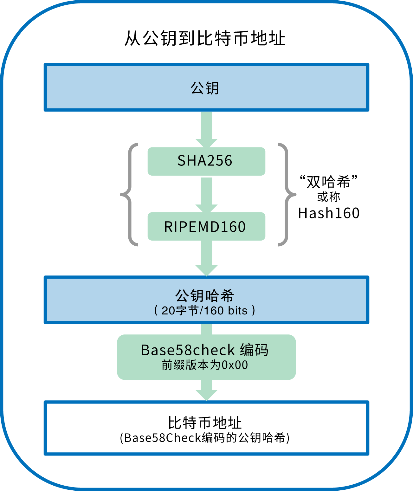
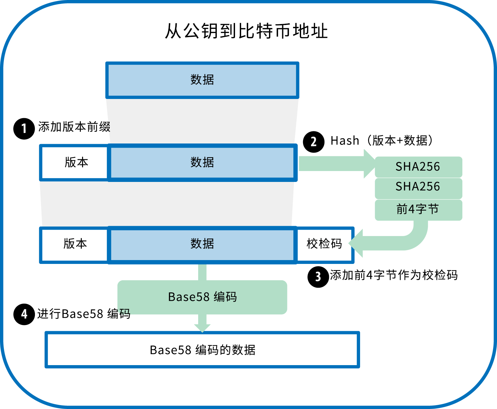
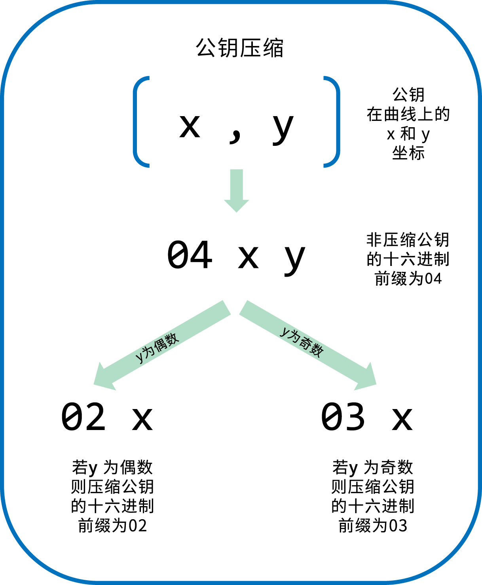
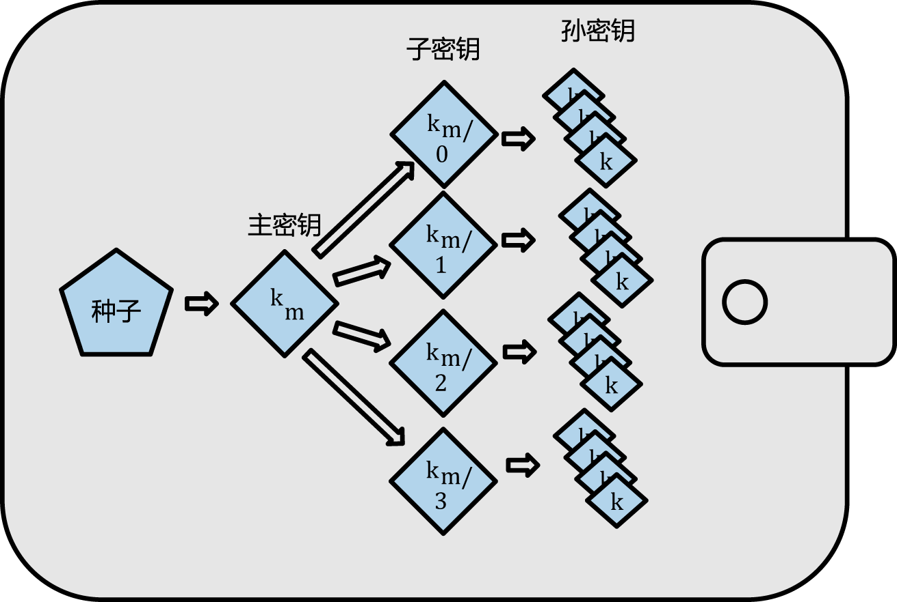
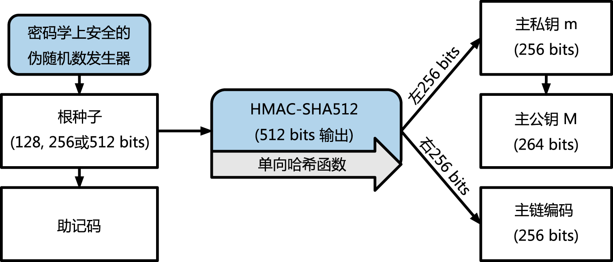
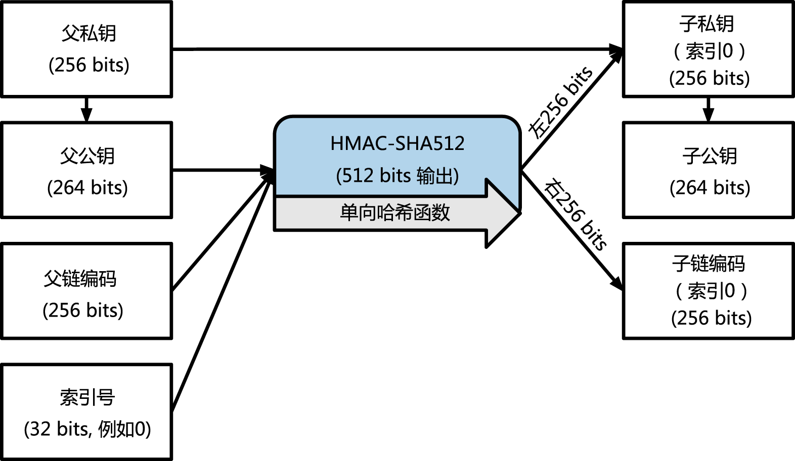
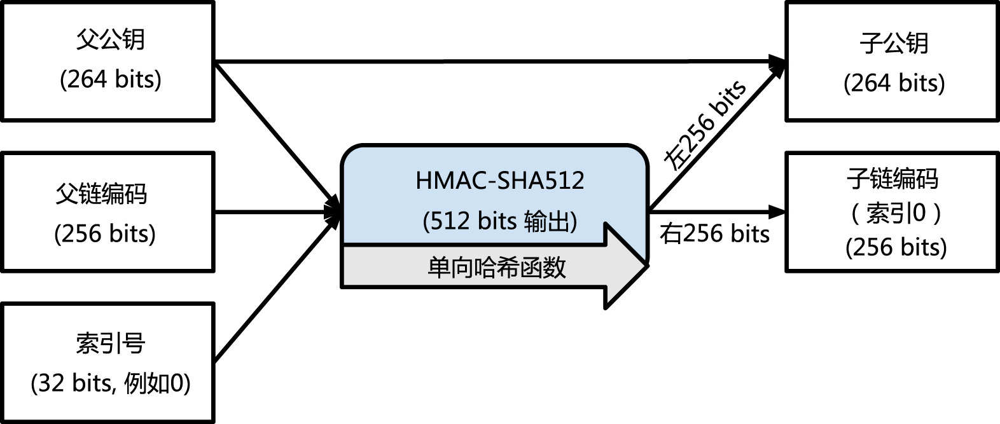
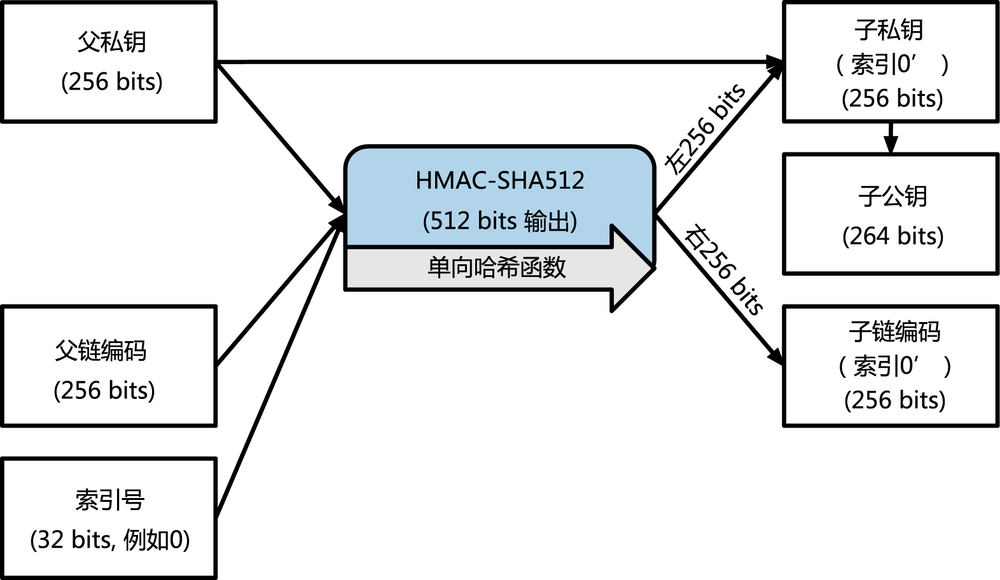

# 第4章 密钥、地址、钱包

## 4.1 简介

比特币的所有权是通过数字密钥、比特币地址和数字签名来确立的。数字密钥实际上并不是存储在网络中，而是由用户生成并存储在一个文件或简单的数据库中，称为钱包。存储在用户钱包中的数字密钥完全独立于比特币协议，可由用户的钱包软件生成并管理，而无需区块链或网络连接。密钥实现了比特币的许多有趣特性，包括去中心化信任和控制、所有权认证和基于密码学证明的安全模型。

每笔比特币交易都需要一个有效的签名才会被存储在区块链。只有有效的数字密钥才能产生有效的数字签名，因此拥有比特币的密钥副本就拥有了该帐户的比特币控制权。密钥是成对出现的，由一个私钥和一个公钥所组成。公钥就像银行的帐号，而私钥就像控制账户的PIN码或支票的签名。比特币的用户很少会直接看到数字密钥。一般情况下，它们被存储在钱包文件内，由比特币钱包软件进行管理。 

在比特币交易的支付环节，收件人的公钥是通过其数字指纹表示的，称为比特币地址，就像支票上的支付对象的名字（即“收款方”）。一般情况下，比特币地址由一个公钥生成并对应于这个公钥。然而，并非所有比特币地址都是公钥；他们也可以代表其他支付对象，譬如脚本，我们将在本章后面提及。这样一来，比特币地址把收款方抽象起来了，使得交易的目的地更灵活，就像支票一样：这个支付工具可支付到个人账户、公司账户，进行账单支付或现金支付。比特币地址是用户经常看到的密钥的唯一代表，他们只需要把比特币地址告诉其他人即可。 

在本章中，我们将介绍钱包，也就是密钥所在之处。我们将了解密钥如何被产生、存储和管理。我们将回顾私钥和公钥、地址和脚本地址的各种编码格式。最后，我们将讲解密钥的特殊用途：生成签名、证明所有权以及创造比特币靓号地址和纸钱包。

### 4.1.1 公钥加密和加密货币

公钥加密发明于20世纪70年代。它是计算机和信息安全的数学基础。

自从公钥加密被发明之后，一些合适的数学函数被提出，譬如：素数幂和椭圆曲线乘法。这些数学函数都是不可逆的，就是说很容易向一个方向计算，但不可以向相反方向倒推。基于这些数学函数的密码学，使得生成数字密钥和不可伪造的数字签名成为可能。比特币正是使用椭圆曲线乘法作为其公钥加密的基础算法。

在比特币系统中，我们用公钥加密创建一个密钥对，用于控制比特币的获取。密钥对包括一个私钥，和由其衍生出的唯一的公钥。公钥用于接收比特币，而私钥用于比特币支付时的交易签名。 

公钥和私钥之间的数学关系，使得私钥可用于生成特定消息的签名。此签名可以在不泄露私钥的同时对公钥进行验证。 

支付比特币时，比特币的当前所有者需要在交易中提交其公钥和签名（每次交易的签名都不同，但均从同一个私钥生成）。比特币网络中的所有人都可以通过所提交的公钥和签名进行验证，并确认该交易是否有效，即确认支付者在该时刻对所交易的比特币拥有所有权。

>  
<br> 大多数比特币钱包工具为了方便会将私钥和公钥以密钥对的形式存储在一起。然而，公钥可以由私钥计算得到，所以只存储私钥也是可以的。

### 4.1.2 私钥和公钥

一个比特币钱包中包含一系列的密钥对，每个密钥对包括一个私钥和一个公钥。私钥（k）是一个数字，通常是随机选出的。有了私钥，我们就可以使用椭圆曲线乘法这个单向加密函数产生一个公钥（K）。有了公钥（K），我们就可以使用一个单向加密哈希函数生成比特币地址（A）。在本节中，我们将从生成私钥开始，讲述如何使用椭圆曲线运算将私钥生成公钥，并最终由公钥生成比特币地址。私钥、公钥和比特币地址之间的关系如下图所示。

 

### 4.1.3 私钥

私钥就是一个随机选出的数字而已。一个比特币地址中的所有资金的控制取决于相应私钥的所有权和控制权。在比特币交易中，私钥用于生成支付比特币所必需的签名以证明资金的所有权。私钥必须始终保持机密，因为一旦被泄露给第三方，相当于该私钥保护之下的比特币也拱手相让了。私钥还必须进行备份，以防意外丢失，因为私钥一旦丢失就难以复原，其所保护的比特币也将永远丢失。

>  
<br> 比特币私钥只是一个数字。你可以用硬币、铅笔和纸来随机生成你的私钥：掷硬币256次，用纸和笔记录正反面并转换为0和1，随机得到的256位二进制数字可作为比特币钱包的私钥。该私钥可进一步生成公钥。

#### 从一个随机数生成私钥

生成密钥的第一步也是最重要的一步，是要找到足够安全的熵源，即随机性来源。生成一个比特币私钥在本质上与“在1到2<sup>256</sup>之间选一个数字”无异。只要选取的结果是不可预测或不可重复的，那么选取数字的具体方法并不重要。比特币软件使用操作系统底层的随机数生成器来产生256位的熵（随机性）。通常情况下，操作系统随机数生成器由人工的随机源进行初始化，也可能需要通过几秒钟内不停晃动鼠标等方式进行初始化。对于真正的偏执狂，可以使用掷骰子的方法，并用铅笔和纸记录。 

更准确地说，私钥可以是1和n-1之间的任何数字，其中n是一个常数（n=1.158*10<sup>77</sup>，略小于2<sup>256</sup>），并由比特币所使用的椭圆曲线的阶所定义（见<a href="chapter04.html#4-1-5-%E6%A4%AD%E5%9C%86%E6%9B%B2%E7%BA%BF%E5%AF%86%E7%A0%81%E5%AD%A6%E8%A7%A3%E9%87%8A">4.1.5 椭圆曲线密码学解释</a>）。要生成这样的一个私钥，我们随机选择一个256位的数字，并检查它是否小于n-1。从编程的角度来看，一般是通过在一个密码学安全的随机源中取出一长串随机字节，对其使用SHA256哈希算法进行运算，这样就可以方便地产生一个256位的数字。如果运算结果小于n-1，我们就有了一个合适的私钥。否则，我们就用另一个随机数再重复一次。

>  
<br> 本书强烈建议读者不要使用自己写的代码或使用编程语言内建的简易随机数生成器来获得一个随机数。我们建议读者使用密码学安全的伪随机数生成器（CSPRNG），并且需要有一个来自具有足够熵值的源的种子。使用随机数发生器的程序库时，需仔细研读其文档，以确保它是加密安全的。对CSPRNG的正确实现是密钥安全性的关键所在。

以下是一个随机生成的私钥（k），以十六进制格式表示（256位的二进制数，以64位十六进制数显示，每个十六进制数占4位）：

```
1E99423A4ED27608A15A2616A2B0E9E52CED330AC530EDCC32C8FFC6A526AEDD
```

>  
<br> 比特币私钥空间的大小是2<sup>256</sup>，这是一个非常大的数字。用十进制表示的话，大约是10<sup>77</sup>，而可见宇宙被估计只含有10<sup>80</sup>个原子。

要使用比特币核心客户端生成一个新的密钥（参见<a href="chapter03.html#%E7%AC%AC3%E7%AB%A0-%E6%AF%94%E7%89%B9%E5%B8%81%E5%AE%A2%E6%88%B7%E7%AB%AF">第3章</a>），可使用`getnewaddress`命令。出于安全考虑，命令运行后只显示生成的公钥，而不显示私钥。如果要bitcoind显示私钥，可以使用`dumpprivkey`命令。`dumpprivkey`命令会把私钥以Base58校验和编码格式显示，这种私钥格式被称为钱包导入格式（WIF，Wallet Import Format），在“<a href="chapter04.html#%E7%A7%81%E9%92%A5%E7%9A%84%E6%A0%BC%E5%BC%8F">私钥的格式</a>”一节有详细讲解。下面给出了使用这两个命令生成和显示私钥的例子：

```
$ bitcoind getnewaddress
1J7mdg5rbQyUHENYdx39WVWK7fsLpEoXZy
$ bitcoind dumpprivkey 1J7mdg5rbQyUHENYdx39WVWK7fsLpEoXZy
KxFC1jmwwCoACiCAWZ3eXa96mBM6tb3TYzGmf6YwgdGWZgawvrtJ
```

`dumpprivkey`命令只是读取钱包里由`getnewaddress`命令生成的私钥，然后显示出来。bitcoind的并不能从公钥得知私钥。除非密钥对都存储在钱包里，`dumpprivkey`命令才有效。	

>  
<br> `dumpprivkey`命令无法从公钥得到对应的私钥，因为这是不可能的。这个命令只是提取钱包中已有的私钥，也就是提取由`getnewaddress`命令生成的私钥。

你也可以使用命令行sx工具 （参见“<a href="chapter03.html#3-3-1-libbitcoin%E5%92%8Csx-tools">3.3.1 Libbitcoin和sx Tools</a>”）用newkey命令来生成并显示私钥:

```
$ sx newkey
5J3mBbAH58CpQ3Y5RNJpUKPE62SQ5tfcvU2JpbnkeyhfsYB1Jcn
```

### 4.1.4 公钥

通过椭圆曲线乘法可以从私钥计算得到公钥，这是不可逆转的过程：`K = k * G` 。其中`k`是私钥，`G`是被称为生成点的常数点，而`K`是所得公钥。其反向运算，被称为“寻找离散对数”——已知公钥`K`来求出私钥`k`——是非常困难的，就像去试验所有可能的`k`值，即暴力搜索。在演示如何从私钥生成公钥之前，我们先稍微详细学习下椭圆曲线加密学。

### 4.1.5 椭圆曲线密码学解释

椭圆曲线加密法是一种基于离散对数问题的非对称（或公钥）加密法，可以用对椭圆曲线上的点进行加法或乘法运算来表达。

 

上图是一个椭圆曲线的示例，类似于比特币所用的曲线。

比特币使用了`secp256k1`标准所定义的一条特殊的椭圆曲线和一系列数学常数。该标准由美国国家标准与技术研究院（NIST）设立。`secp256k1`曲线由下述函数定义，该函数可产生一条椭圆曲线：	

y<sup>2</sup> = (x<sup>3</sup> + 7)} over (F<sub>*p*</sub>)

或

y<sup>2</sup> mod *p* = (x<sup>3</sup> + 7) mod *p*

上述*mod p*（素数p取模）表明该曲线是在素数阶*p*的有限域内，也写作F<sub>*p*</sub>，其中p = 2<sup>256</sup> – 2<sup>32</sup> – 2<sup>9</sup> – 2<sup>8</sup> – 2<sup>7</sup> – 2<sup>6</sup> – 2<sup>4</sup> – 1，这是一个非常大的素数。 

因为这条曲线被定义在一个素数阶的有限域内，而不是定义在实数范围，它的函数图像看起来像分散在两个维度上的散点图，因此很难画图表示。不过，其中的数学原理与实数范围的椭圆曲线相似。作为一个例子，下图显示了在一个小了很多的素数阶17的有限域内的椭圆曲线，其形式为网格上的一系列散点。而`secp256k1`的比特币椭圆曲线可以被想象成一个极大的网格上一系列更为复杂的散点。

 

图为：椭圆曲线密码学F(<sub>*p*</sub>)上的椭圆曲线，其中p = 17

下面举一个例子，这是`secp256k1`曲线上的点P，其坐标为(x，y)。可以使用Python对其检验：

```
P =（55066263022277343669578718895168534326250603453777594175500187360389116729240,32670510020758816978083085130507043184471273380659243275938904335757337482424）

Python 3.4.0 (default, Mar 30 2014, 19:23:13)
[GCC 4.2.1 Compatible Apple LLVM 5.1 (clang-503.0.38)] on darwin
Type "help", "copyright", "credits" or "license" for more information.
>>> p = 115792089237316195423570985008687907853269984665640564039457584007908834671663
>>> x = 55066263022277343669578718895168534326250603453777594175500187360389116729240
>>> y = 32670510020758816978083085130507043184471273380659243275938904335757337482424
>>> (x ** 3 + 7 - y**2) % p
0
```

在椭圆曲线的数学原理中，有一个点被称为“无穷远点”，这大致对应于0在加法中的作用。计算机中，它有时表示为X = Y = 0（虽然这不满足椭圆曲线方程，但可作为特殊情况进行检验）。 还有一个 + 运算符，被称为“加法”，就像小学数学中的实数相加。给定椭圆曲线上的两个点P<sub>1</sub>和P<sub>2</sub>，则椭圆曲线上必定有第三点 P<sub>3</sub> = P<sub>1</sub> + P<sub>2</sub>。

几何图形中，该第三点P<sub>3</sub>可以在P<sub>1</sub>和P<sub>2</sub>之间画一条线来确定。这条直线恰好与椭圆曲线上的一点相交。此点记为 P<sub>3</sub>'=(x，y)。然后，在x轴做映射获得 P<sub>3</sub>=(x，-y)。 

下面是几个可以解释“无穷远点”之存在需要的特殊情况。 
若 P<sub>1</sub>和 P<sub>2</sub>是同一点，P<sub>1</sub>和P<sub>2</sub>间的连线则为点P<sub>1</sub> 的切线。曲线上有且只有一个新的点与该切线相交。该切线的斜率可用微分求得。即使限制曲线点为两个整数坐标也可求得斜率！ 

在某些情况下（即，如果P<sub>1</sub>和P<sub>2</sub>具有相同的x值，但不同的y值），则切线会完全垂直，在这种情况下，P<sub>3</sub> = “无穷远点”。 

若P1就是“无穷远点”，那么其和 P<sub>1</sub> + P<sub>2</sub>= P<sub>2</sub>。类似地，当P<sub>2</sub>是无穷远点，则P<sub>1</sub>+ P<sub>2</sub> = P<sub>1</sub>。这就是把无穷远点类似于0的作用。 

事实证明，在这里 + 运算符遵守结合律，这意味着(A+B)C = A(B+C)。这就是说我们可以直接不加括号书写 A + B + C，而不至于混淆。 

至此，我们已经定义了椭圆加法，为扩展加法下面我们对乘法进行标准定义。给定椭圆曲线上的点P，如果k是整数，则 kP = P + P + P + …+ P（k次）。注意，k被有时被混淆而称为“指数”。

### 4.1.6 生成公钥

以一个随机生成的私钥k为起点，我们将其与曲线上已定义的 生成点G相乘以获得曲线上的另一点，也就是相应的公钥K。生成点是secp256k1标准的一部分，比特币密钥的生成点都是相同的：

```
{K = k * G}
```

其中k是私钥，G是生成点，在该曲线上所得的点K是公钥。因为所有比特币用户的生成点是相同的，一个私钥k乘以G将得到相同的公钥K。k和K之间的关系是固定的，但只能单向运算，即从k得到K。这就是可以把比特币地址（K的衍生）与任何人共享而不会泄露私钥（k）的原因。

>  
<br> 因为其中的数学运算是单向的，所以私钥可以转换为公钥，但公钥不能转换回私钥。

为实现椭圆曲线乘法，我们以之前产生的私钥k和与生成点G相乘得到公钥K：

```
K = 1E99423A4ED27608A15A2616A2B0E9E52CED330AC530EDCC32C8FFC6A526AEDD * G
```

公钥K 被定义为一个点 K = (x, y)：

```
K = (x, y)

其中，

x = F028892BAD7ED57D2FB57BF33081D5CFCF6F9ED3D3D7F159C2E2FFF579DC341A
y = 07CF33DA18BD734C600B96A72BBC4749D5141C90EC8AC328AE52DDFE2E505BDB
```

为了展示整数点的乘法，我们将使用较为简单的实数范围的椭圆曲线。请记住，其中的数学原理是相同的。我们的目标是找到生成点G的倍数kG。也就是将G相加k次。在椭圆曲线中，点的相加等同于从该点画切线找到与曲线相交的另一点，然后映射到x轴。 

 

上图显示了在曲线上得到 G、2G、4G 的几何操作。

>  
<br> 大多数比特币程序使用OpenSSL加密库进行椭圆曲线计算。例如，调用EC_POINT_mul() 函数，可计算得到公钥。

## 4.2 比特币地址

比特币地址是一个由数字和字母组成的字符串，可以与任何想给你比特币的人分享。由公钥（一个同样由数字和字母组成的字符串）生成的比特币地址以数字“1”开头。下面是一个比特币地址的例子：

```
1J7mdg5rbQyUHENYdx39WVWK7fsLpEoXZy
```

在交易中，比特币地址通常以收款方出现。如果把比特币交易比作一张支票，比特币地址就是收款人，也就是我们要写入收款人一栏的内容。一张支票的收款人可能是某个银行账户，也可能是某个公司、机构，甚至是现金支票。支票不需要指定一个特定的账户，而是用一个普通的名字作为收款人，这使它成为一种相当灵活的支付工具。与此类似，比特币地址的使用也使比特币交易变得很灵活。比特币地址可以代表一对公钥和私钥的所有者，也可以代表其它东西，比如会在132页的“P2SH (Pay-to-Script-Hash)”一节讲到的付款脚本。现在，让我们来看一个简单的例子，由公钥生成比特币地址。 

比特币地址可由公钥经过单向的加密哈希算法得到。哈希算法是一种单向函数，接收任意长度的输入产生指纹摘要。加密哈希函数在比特币中被广泛使用：比特币地址、脚本地址以及在挖矿中的工作量证明算法。由公钥生成比特币地址时使用的算法是Secure Hash Algorithm (SHA)和the RACE Integrity Primitives Evaluation Message Digest (RIPEMD)，特别是SHA256和RIPEMD160。 

以公钥 K 为输入，计算其SHA256哈希值，并以此结果计算RIPEMD160 哈希值，得到一个长度为160比特（20字节）的数字：

```
A = RIPEMD160(SHA256(K))
```

公式中，K是公钥，A是生成的比特币地址。

>  
<br> 比特币地址与公钥不同。比特币地址是由公钥经过单向的哈希函数生成的。

通常用户见到的比特币地址是经过“Base58Check”编码的（参见72页“Base58和Base58Check编码”一节），这种编码使用了58个字符（一种Base58数字系统）和校验码，提高了可读性、避免歧义并有效防止了在地址转录和输入中产生的错误。Base58Check编码也被用于比特币的其它地方，例如比特币地址、私钥、加密的密钥和脚本哈希中，用来提高可读性和录入的正确性。下一节中我们会详细解释Base58Check的编码机制，以及它产生的结果。下图描述了如何从公钥生成比特币地址。

 

### 4.2.1 Base58和Base58Check编码

为了更简洁方便地表示长串的数字，许多计算机系统会使用一种以数字和字母组成的大于十进制的表示法。例如，传统的十进制计数系统使用0-9十个数字，而十六进制系统使用了额外的 A-F 六个字母。一个同样的数字，它的十六进制表示就会比十进制表示更短。更进一步，Base64使用了26个小写字母、26个大写字母、10个数字以及两个符号（例如“+”和“/”），用于在电子邮件这样的基于文本的媒介中传输二进制数据。Base64通常用于编码邮件中的附件。Base58是一种基于文本的二进制编码格式，用在比特币和其它的加密货币中。这种编码格式不仅实现了数据压缩，保持了易读性，还具有错误诊断功能。Base58是Base64编码格式的子集，同样使用大小写字母和10个数字，但舍弃了一些容易错读和在特定字体中容易混淆的字符。具体地，Base58不含Base64中的0（数字0）、O（大写字母o）、l（小写字母L）、I（大写字母i），以及“+”和“/”两个字符。简而言之，Base58就是由不包括（0，O，l，I）的大小写字母和数字组成。

例4-1 比特币的Base58字母表

```
123456789ABCDEFGHJKLMNPQRSTUVWXYZabcdefghijkmnopqrstuvwxyz
```

Base58Check是一种常用在比特币中的Base58编码格式，增加了错误校验码来检查数据在转录中出现的错误。校验码长4个字节，添加到需要编码的数据之后。校验码是从需要编码的数据的哈希值中得到的，所以可以用来检测并避免转录和输入中产生的错误。使用Base58check编码格式时，编码软件会计算原始数据的校验码并和结果数据中自带的校验码进行对比。二者不匹配则表明有错误产生，那么这个Base58Check格式的数据就是无效的。例如，一个错误比特币地址就不会被钱包认为是有效的地址，否则这种错误会造成资金的丢失。 

为了使用Base58Check编码格式对数据（数字）进行编码，首先我们要对数据添加一个称作“版本字节”的前缀，这个前缀用来明确需要编码的数据的类型。例如，比特币地址的前缀是0（十六进制是0x00），而对私钥编码时前缀是128（十六进制是0x80）。 表4-1会列出一些常见版本的前缀。

接下来，我们计算“双哈希”校验码，意味着要对之前的结果（前缀和数据）运行两次SHA256哈希算法：

```
checksum = SHA256(SHA256(prefix+data))
```

在产生的长32个字节的哈希值（两次哈希运算）中，我们只取前4个字节。这4个字节就作为校验码。校验码会添加到数据之后。 

结果由三部分组成：前缀、数据和校验码。这个结果采用之前描述的Base58字母表编码。下图描述了Base58Check编码的过程。

 

> Base58Check编码：一种Base58格式的、有版本的、经过校验的格式，可以明确的对比特币数据编码的编码格式

在比特币中，大多数需要向用户展示的数据都使用Base58Check编码，可以实现数据压缩，易读而且有错误检验。Base58Check编码中的版本前缀是数据的格式易于辨别，编码之后的数据头包含了明确的属性。这些属性使用户可以轻松明确被编码的数据的类型以及如何使用它们。例如我们可以看到他们的不同，Base58Check编码的比特币地址是以1开头的，而Base58Check编码的私钥WIF是以5开头的。表4-1展示了一些版本前缀和他们对应的Base58格式。

**表4-1 Base58Check版本前缀和编码后的结果**

| 种类 | 版本前缀 (hex) | Base58格式 |
| -- | -- | -- |
| Bitcoin Address| 0x00 | 1 |
| Pay-to-Script-Hash Address | 0x05 | 3 |
| Bitcoin Testnet Address | 0x6F | m or n |
| Private Key WIF | 0x80 | 5, K or L |
| BIP38 Encrypted Private Key | 0x0142 | 6P |
| BIP32 Extended Public Key | 0x0488B21E | xpub |

我们回顾比特币地址产生的完整过程，从私钥、到公钥（椭圆曲线上某个点）、再到两次哈希的地址，最终产生Base58Check格式的比特币地址。例4-2的C++代码完整详细的展示了从私钥到Base58Check编码后的比特币地址的步骤。代码中使用“<a href="chapter03.html#3-3-%E5%85%B6%E4%BB%96%E6%9B%BF%E4%BB%A3%E5%AE%A2%E6%88%B7%E7%AB%AF%E3%80%81%E8%B5%84%E6%96%99%E5%BA%93%E3%80%81%E5%B7%A5%E5%85%B7%E5%8C%85">3.3 其他客户端、资料库、工具包 </a>”一节中介绍的libbitcoin library来实现某些辅助功能。

例4-2 从私钥产生一个Base58Check格式编码的比特币地址

```
#include <bitcoin/bitcoin.hpp>

int main() {
    // Private secret key.
    bc::ec_secret secret = bc::decode_hash(
        "038109007313a5807b2eccc082c8c3fbb988a973cacf1a7df9ce725c31b14776");
    // Get public key.
    bc::ec_point public_key = bc::secret_to_public_key(secret);
    std::cout << "Public key: " << bc::encode_hex(public_key) << std::endl;
    
    // Create Bitcoin address.
    // Normally you can use:
    //   bc::payment_address payaddr;
    //   bc::set_public_key(payaddr, public_key);
    //   const std::string address = payaddr.encoded();
    
    // Compute hash of public key for P2PKH address.
    const bc::short_hash hash = bc::bitcoin_short_hash(public_key);
    bc::data_chunk unencoded_address; // Reserve 25 bytes
    // [ version:1 ]
    // [ hash:20 ]
    //   [ checksum:4 ]
    unencoded_address.reserve(25);
    // Version byte, 0 is normal BTC address (P2PKH).     unencoded_address.push_back(0);
    // Hash data
    bc::extend_data(unencoded_address, hash);
    // Checksum is computed by hashing data, and adding 4 bytes from hash. bc::append_checksum(unencoded_address);
    // Finally we must encode the result in Bitcoin's base58 encoding assert(unencoded_address.size() == 25);
    const std::string address = bc::encode_base58(unencoded_address);
    std::cout << "Address: " << address << std::endl;
    return 0; 
}
```

正如编译并运行addr代码中展示的，由于代码使用预定义的私钥，所以每次运行都会产生相同的比特币地址。如例4-3所示。

例4-3 编译并运行addr代码

```
# Compile the addr.cpp code
$ g++ -o addr addr.cpp $(pkg-config --cflags --libs libbitcoin)
# Run the addr executable
$ ./addr
Public key: 0202a406624211f2abbdc68da3df929f938c3399dd79fac1b51b0e4ad1d26a47aa Address: 1PRTTaJesdNovgne6Ehcdu1fpEdX7913CK
```

### 4.2.2 密钥的格式

公钥和私钥的都可以有多种编码格式。一个密钥被不同的格式编码后，虽然结果看起来可能不同，但是密钥所编码数字并没有改变。这些不同的编码格式主要是用来方便人们无误地使用和识别密钥。

#### 私钥的格式

私钥可以以许多不同的格式表示，所有这些都对应于相同的256位的数字。表4-2展示了私钥的三种常见格式。

**表4-2 私钥表示法（编码格式）**

| 种类 | 版本 | 描述 |
| -- | -- | -- |
| Hex | None | 64 hexadecimal digits |
| WIF | 5 | Base58Check encoding: Base58 with version prefix of 128 and 32-bit checksum |
| WIF-compressed | K or L | As above, with added suffix 0x01 before encoding |

表4-3展示了用这三种格式所生成的私钥。

**表4-3 示例：同样的私钥，不同的格式**

| 格式 | 私钥 |
| -- | -- |
| Hex | 1E99423A4ED27608A15A2616A2B0E9E52CED330AC530EDCC32C8FFC6A526AEDD |
| WIF | 5J3mBbAH58CpQ3Y5RNJpUKPE62SQ5tfcvU2JpbnkeyhfsYB1Jcn |
| WIF-compressed | KxFC1jmwwCoACiCAWZ3eXa96mBM6tb3TYzGmf6YwgdGWZgawvrtJ |

这些表示法都是用来表示相同的数字、相同的私钥的不同方法。虽然编码后的字符串看起来不同，但不同的格式彼此之间可以很容易地相互转换。 

#### 将Base58Check编码解码为十六进制

sx工具包（参见“<a href="chapter03.html#3-3-1-libbitcoin%E5%92%8Csx-tools">3.3.1 Libbitcoin和sx Tools</a>”）可用来编写一些操作比特币密钥、地址及交易的shell脚本和命令行“管道”。你也可以使用sx工具从命令行对Base58Check格式进行解码。

我们使用的命令是`base58check-decode`：

```
$ sx base58check-decode 5J3mBbAH58CpQ3Y5RNJpUKPE62SQ5tfcvU2JpbnkeyhfsYB1Jcn
1e99423a4ed27608a15a2616a2b0e9e52ced330ac530edcc32c8ffc6a526aedd 128
```

所得结果是十六进制的密钥，紧接着是钱包导入格式（Wallet Import Format,WIF）的版本前缀128。

#### 将十六进制转换为Base58Check编码

要转换成Base58Check编码（和之前的命令正好相反），我们需提供十六进制的私钥和钱包导入格式（Wallet Import Format，WIF）的版本号前缀128：

```
$sx base58check-encode 1e99423a4ed27608a15a2616a2b0e9e52ced330ac530edcc32c8ffc6a526aedd 128 
5J3mBbAH58CpQ3Y5RNJpUKPE62SQ5tfcvU2JpbnkeyhfsYB1Jcn
```

#### 将十六进制（压缩格式密钥）转换为Base58Check编码

要将压缩格式的私钥编码为Base58Check（参见“<a href="chapter04.html#%E5%8E%8B%E7%BC%A9%E6%A0%BC%E5%BC%8F%E7%A7%81%E9%92%A5">压缩格式私钥</a>”一节），我们需在十六进制私钥的后面添加后缀01，然后使用跟上面一样的方法：

```
$ sx base58check-encode 1e99423a4ed27608a15a2616a2b0e9e52ced330ac530edcc32c8ffc6a526aedd01 128
KxFC1jmwwCoACiCAWZ3eXa96mBM6tb3TYzGmf6YwgdGWZgawvrtJ
```

生成的WIF压缩格式的私钥以字母“K”开头，用以表明被编码的私钥有一个后缀“01”，且该私钥只能被用于生成压缩格式的公钥（参见“<a href="chapter04.html#%E5%8E%8B%E7%BC%A9%E6%A0%BC%E5%BC%8F%E5%85%AC%E9%92%A5">压缩格式公钥</a>”一节）。

#### 公钥的格式

公钥也可以用多种不同格式来表示，最重要的是它们分为非压缩格式或压缩格式公钥这两种形式。 

我们从前文可知，公钥是在椭圆曲线上的一个点，由一对坐标（x，y）组成。公钥通常表示为前缀04紧接着两个256比特的数字。其中一个256比特数字是公钥的x坐标，另一个256比特数字是y坐标。前缀04是用来区分非压缩格式公钥，压缩格式公钥是以02或者03开头。 

下面是由前文中的私钥所生成的公钥，其坐标x和y如下：

```
x = F028892BAD7ED57D2FB57BF33081D5CFCF6F9ED3D3D7F159C2E2FFF579DC341A
y = 07CF33DA18BD734C600B96A72BBC4749D5141C90EC8AC328AE52DDFE2E505BDB
```

下面是同样的公钥以520比特的数字（130个十六进制数字）来表达。这个520比特的数字以前缀04开头，紧接着是x及y坐标，组成格式为04 x y：

```
K = 04F028892BAD7ED57D2FB57BF33081D5CFCF6F9ED3D3D7F159C2E2FFF579DC341A07CF33DA18BD734C600B96A72BBC4749D5141C90EC8AC328AE52DDFE2E505BDB
```

#### 压缩格式公钥

引入压缩格式公钥是为了减少比特币交易的字节数，从而可以节省那些运行区块链数据库的节点磁盘空间。大部分比特币交易包含了公钥，用于验证用户的凭据和支付比特币。每个公钥有520比特（包括前缀，x坐标，y坐标）。如果每个区块有数百个交易，每天有成千上万的交易发生，区块链里就会被写入大量的数据。 

正如我们在“<a href="chapter04.html#4-1-4-%E5%85%AC%E9%92%A5">4.1.4 公钥</a>”一节所见，一个公钥是一个椭圆曲线上的点(x, y)。而椭圆曲线实际是一个数学方程，曲线上的点实际是该方程的一个解。因此，如果我们知道了公钥的x坐标，就可以通过解方程y<sup>2</sup> mod p = (x<sup>3</sup>  + 7) mod p得到y坐标。这种方案可以让我们只存储公钥的x坐标，略去y坐标，从而将公钥的大小和存储空间减少了256比特。每个交易所需要的字节数减少了近一半，随着时间推移，就大大节省了很多数据传输和存储。

未压缩格式公钥使用04作为前缀，而压缩格式公钥是以02或03作为前缀。需要这两种不同前缀的原因是：因为椭圆曲线加密的公式的左边是y<sup>2</sup> ，也就是说y的解是来自于一个平方根，可能是正值也可能是负值。更形象地说，y坐标可能在x坐标轴的上面或者下面。从图4-2的椭圆曲线图中可以看出，曲线是对称的，从x轴看就像对称的镜子两面。因此，如果我们略去y坐标，就必须储存y的符号（正值或者负值）。换句话说，对于给定的x值，我们需要知道y值在x轴的上面还是下面，因为它们代表椭圆曲线上不同的点，即不同的公钥。当我们在素数p阶的有限域上使用二进制算术计算椭圆曲线的时候，y坐标可能是奇数或者偶数，分别对应前面所讲的y值的正负符号。因此，为了区分y坐标的两种可能值，我们在生成压缩格式公钥时，如果y是偶数，则使用02作为前缀；如果y是奇数，则使用03作为前缀。这样就可以根据公钥中给定的x值，正确推导出对应的y坐标，从而将公钥解压缩为在椭圆曲线上的完整的点坐标。下图阐释了公钥压缩：



下面是前述章节所生成的公钥，使用了264比特（66个十六进制数字）的压缩格式公钥格式，其中前缀03表示y坐标是一个奇数：

```
K = 03F028892BAD7ED57D2FB57BF33081D5CFCF6F9ED3D3D7F159C2E2FFF579DC341A
```

这个压缩格式公钥对应着同样的一个私钥，这意味它是由同样的私钥所生成。但是压缩格式公钥和非压缩格式公钥差别很大。更重要的是，如果我们使用双哈希函数(RIPEMD160(SHA256(K)))将压缩格式公钥转化成比特币地址，得到的地址将会不同于由非压缩格式公钥产生的地址。这种结果会让人迷惑，因为一个私钥可以生成两种不同格式的公钥——压缩格式和非压缩格式，而这两种格式的公钥可以生成两个不同的比特币地址。但是，这两个不同的比特币地址的私钥是一样的。 

压缩格式公钥渐渐成为了各种不同的比特币客户端的默认格式，它可以大大减少交易所需的字节数，同时也让存储区块链所需的磁盘空间变小。然而，并非所有的客户端都支持压缩格式公钥，于是那些较新的支持压缩格式公钥的客户端就不得不考虑如何处理那些来自较老的不支持压缩格式公钥的客户端的交易。这在钱包应用导入另一个钱包应用的私钥的时候就会变得尤其重要，因为新钱包需要扫描区块链并找到所有与这些被导入私钥相关的交易。比特币钱包应该扫描哪个比特币地址呢？新客户端不知道应该使用哪个公钥：因为不论是通过压缩的公钥产生的比特币地址，还是通过非压缩的公钥产生的地址，两个都是合法的比特币地址，都可以被私钥正确签名，但是他们是完全不同的比特币地址。 

为了解决这个问题，当私钥从钱包中被导出时，较新的比特币客户端将使用一种不同的钱包导入格式（Wallet Import Format）。这种新的钱包导入格式可以用来表明该私钥已经被用来生成压缩的公钥，同时生成的比特币地址也是基于该压缩的公钥。这个方案可以解决导入私钥来自于老钱包还是新钱包的问题，同时也解决了通过公钥生成的比特币地址是来自于压缩格式公钥还是非压缩格式公钥的问题。最后新钱包在扫描区块链时，就可以使用对应的比特币地址去查找该比特币地址在区块链里所发生的交易。我们将在下一节详细解释这种机制是如何工作的。

#### 压缩格式私钥

实际上“压缩格式私钥”是一种名称上的误导，因为当一个私钥被使用WIF压缩格式导出时，不但没有压缩，而且比“非压缩格式”私钥长出一个字节。这个多出来的一个字节是私钥被加了后缀01，用以表明该私钥是来自于一个较新的钱包，只能被用来生成压缩的公钥。私钥是非压缩的，也不能被压缩。“压缩的私钥”实际上只是表示“用于生成压缩格式公钥的私钥”，而“非压缩格式私钥”用来表明“用于生成非压缩格式公钥的私钥”。为避免更多误解，应该只可以说导出格式是“WIF压缩格式”或者“WIF”，而不能说这个私钥是“压缩”的。 

要注意的是，这些格式并不是可互换使用的。在较新的实现了压缩格式公钥的钱包中，私钥只能且永远被导出为WIF压缩格式（以K或L为前缀）。对于较老的没有实现压缩格式公钥的钱包，私钥将只能被导出为WIF格式（以5为前缀）导出。这样做的目的就是为了给导入这些私钥的钱包一个信号：到底是使用压缩格式公钥和比特币地址去扫描区块链，还是使用非压缩格式公钥和比特币地址。 

如果一个比特币钱包实现了压缩格式公钥，那么它将会在所有交易中使用该压格式缩公钥。钱包中的私钥将会被用来生成压缩格式公钥，压缩格式公钥然后被用来生成交易中的比特币地址。当从一个实现了压缩格式公钥的比特币钱包导出私钥时，钱包导入格式（WIF）将会被修改为WIF压缩格式，该格式将会在私钥的后面附加一个字节大小的后缀01。最终的Base58Check编码格式的私钥被称作WIF（“压缩”）私钥，以字母“K”或“L”开头。而以“5”开头的是从较老的钱包中以WIF（非压缩）格式导出的私钥。 

表4-4展示了同样的私钥使用不同的WIF和WIF压缩格式编码。

**表4-4 示例：同样的私钥，不同的格式**

| 格式 | 私钥 |
| -- | -- |
| Hex | 1E99423A4ED27608A15A2616A2B0E9E52CED330AC530EDCC32C8FFC6A526AEDD |
| WIF | 5J3mBbAH58CpQ3Y5RNJpUKPE62SQ5tfcvU2JpbnkeyhfsYB1Jcn |
| Hex-compressed  | 1E99423A4ED27608A15A2616A2B0E9E52CED330AC530EDCC32C8FFC6A526AEDD_01_ |
| WIF-compressed | KxFC1jmwwCoACiCAWZ3eXa96mBM6tb3TYzGmf6YwgdGWZgawvrtJ |

>  
<br> “压缩格式私钥”是一个不当用词！私钥不是压缩的。WIF压缩格式的私钥只是用来表明他们只能被生成压缩的公钥和对应的比特币地址。相反地，“WIF压缩”编码的私钥还多出一个字节，因为这种私钥多了后缀“01”。该后缀是用来区分“非压缩格式”私钥和“压缩格式”私钥。

## 4.3 用Python实现密钥和比特币地址

最全面的比特币Python库是 Vitalik Buterin写的 [pybitcointools](https://github.com/vbuterin/pybitcointools)。在例4-4中，我们使用pybitcointools库（导入为“bitcoin”）来生成和显示不同格式的密钥和比特币地址。

**例4-4 使用pybitcointools库的密钥和比特币地址的生成和格式化过**

```
import bitcoin

# Generate a random private key
valid_private_key = False while not valid_private_key:
    private_key = bitcoin.random_key()
    decoded_private_key = bitcoin.decode_privkey(private_key, 'hex')
    valid_private_key =  0 < decoded_private_key < bitcoin.N
    
print "Private Key (hex) is: ", private_key
print "Private Key (decimal) is: ", decoded_private_key

# Convert private key to WIF format
wif_encoded_private_key = bitcoin.encode_privkey(decoded_private_key, 'wif')
print "Private Key (WIF) is: ", wif_encoded_private_key

# Add suffix "01" to indicate a compressed private key
compressed_private_key = private_key + '01'
print "Private Key Compressed (hex) is: ", compressed_private_key

# Generate a WIF format from the compressed private key (WIF-compressed)
wif_compressed_private_key = bitcoin.encode_privkey(
    bitcoin.decode_privkey(compressed_private_key, 'hex'), 'wif')
print "Private Key (WIF-Compressed) is: ", wif_compressed_private_key

# Multiply the EC generator point G with the private key to get a public key point
public_key = bitcoin.base10_multiply(bitcoin.G, decoded_private_key) print "Public Key (x,y) coordinates is:", public_key

# Encode as hex, prefix 04
hex_encoded_public_key = bitcoin.encode_pubkey(public_key,'hex') print "Public Key (hex) is:", hex_encoded_public_key

# Compress public key, adjust prefix depending on whether y is even or odd
(public_key_x, public_key_y) = public_key if (public_key_y % 2) == 0:
    compressed_prefix = '02' 
else:
    compressed_prefix = '03'
hex_compressed_public_key = compressed_prefix + bitcoin.encode(public_key_x, 16) print "Compressed Public Key (hex) is:", hex_compressed_public_key
# Generate bitcoin address from public key
print "Bitcoin Address (b58check) is:", bitcoin.pubkey_to_address(public_key)

# Generate compressed bitcoin address from compressed public key
print "Compressed Bitcoin Address (b58check) is:", \             bitcoin.pubkey_to_address(hex_compressed_public_key)
```

例4-5显示了上段代码运行结果。

**例4-5 运行 key-to-address-ecc-example.py**

```
$ python key-to-address-ecc-example.py
Private Key (hex) is:
 3aba4162c7251c891207b747840551a71939b0de081f85c4e44cf7c13e41daa6
Private Key (decimal) is:
 26563230048437957592232553826663696440606756685920117476832299673293013768870
Private Key (WIF) is:
 5JG9hT3beGTJuUAmCQEmNaxAuMacCTfXuw1R3FCXig23RQHMr4K
Private Key Compressed (hex) is:
 3aba4162c7251c891207b747840551a71939b0de081f85c4e44cf7c13e41daa601
Private Key (WIF-Compressed) is:
 KyBsPXxTuVD82av65KZkrGrWi5qLMah5SdNq6uftawDbgKa2wv6S
Public Key (x,y) coordinates is:
 (41637322786646325214887832269588396900663353932545912953362782457239403430124L,
 16388935128781238405526710466724741593761085120864331449066658622400339362166L)
Public Key (hex) is:
 045c0de3b9c8ab18dd04e3511243ec2952002dbfadc864b9628910169d9b9b00ec↵
243bcefdd4347074d44bd7356d6a53c495737dd96295e2a9374bf5f02ebfc176
Compressed Public Key (hex) is:
 025c0de3b9c8ab18dd04e3511243ec2952002dbfadc864b9628910169d9b9b00ec
Bitcoin Address (b58check) is:
 1thMirt546nngXqyPEz532S8fLwbozud8
Compressed Bitcoin Address (b58check) is:
 14cxpo3MBCYYWCgF74SWTdcmxipnGUsPw3
 ```

例4-6是另外一个示例，使用的是Python ECDSA库来做椭圆曲线计算而非使用bitcoin的库。

**例4-6 使用在比特币密钥中的椭圆曲线算法的脚本**

```
import ecdsa
import random
from ecdsa.util import string_to_number, number_to_string

# secp256k1, http://www.oid-info.com/get/1.3.132.0.10
_p = 0xFFFFFFFFFFFFFFFFFFFFFFFFFFFFFFFFFFFFFFFFFFFFFFFFFFFFFFFEFFFFFC2FL
_r = 0xFFFFFFFFFFFFFFFFFFFFFFFFFFFFFFFEBAAEDCE6AF48A03BBFD25E8CD0364141L
_b = 0x0000000000000000000000000000000000000000000000000000000000000007L
_a = 0x0000000000000000000000000000000000000000000000000000000000000000L
_Gx = 0x79BE667EF9DCBBAC55A06295CE870B07029BFCDB2DCE28D959F2815B16F81798L
_Gy = 0x483ada7726a3c4655da4fbfc0e1108a8fd17b448a68554199c47d08ffb10d4b8L
curve_secp256k1 = ecdsa.ellipticcurve.CurveFp(_p, _a, _b)
generator_secp256k1 = ecdsa.ellipticcurve.Point(curve_secp256k1, _Gx, _Gy, _r)
oid_secp256k1 = (1, 3, 132, 0, 10)
SECP256k1 = ecdsa.curves.Curve("SECP256k1", curve_secp256k1, generator_secp256k1,
oid_secp256k1)
ec_order = _r

curve = curve_secp256k1
generator = generator_secp256k1

def random_secret():
    random_char = lambda: chr(random.randint(0, 255))
    convert_to_int = lambda array:     int("".join(array).encode("hex"), 16) 
    byte_array = [random_char() for i in range(32)]
    return convert_to_int(byte_array)

def get_point_pubkey(point): 
    if point.y() & 1:
        key = '03' + '%064x' % point.x() 
    else:
        key = '02' + '%064x' % point.x() 
    return key.decode('hex')
    
def get_point_pubkey_uncompressed(point): 
    key='04'+\
        '%064x' % point.x() + \
        '%064x' % point.y() 
    return key.decode('hex')

# Generate a new private key.
secret = random_secret() 
print "Secret: ", secret

# Get the public key point.
point = secret * generator 
print "EC point:", point

print "BTC public key:", get_point_pubkey(point).encode("hex")

# Given the point (x, y) we can create the object using:
point1 = ecdsa.ellipticcurve.Point(curve, point.x(), point.y(), ec_order) 
assert point1 == point
```

例4-7显示了运行脚本的结果。

**例4-7 安装Python ECDSA库，运行ec_math.py脚本**

```
running the ec_math.py script
$ # Install Python PIP package manager
$ sudo apt-get install python-pip
$ # Install the Python ECDSA library
$ sudo pip install ecdsa
$ # Run the script
$ python ec-math.py
Secret:
38090835015954358862481132628887443905906204995912378278060168703580660294000
EC point:
(70048853531867179489857750497606966272382583471322935454624595540007269312627,
105262206478686743191060800263479589329920209527285803935736021686045542353380)
BTC public key: 029ade3effb0a67d5c8609850d797366af428f4a0d5194cb221d807770a1522873
```

## 4.4 比特币钱包

钱包是私钥的容器，通常通过有序文件或者简单的数据库实现。另外一种制作私钥的途径是 确定性密钥生成。在这里你可以用原先的私钥，通过单向哈希函数来生成每一个新的私钥，并将新生成的密钥按顺序连接。只要你可以重新创建这个序列，你只需要第一个私钥（称作种子、主私钥）来生成它们。在本节中，我们将会检查不同的私钥生成方法及其钱包结构。

>  
<br>  比特币钱包只包含私钥而不是比特币。每一个用户有一个包含多个私钥的钱包。钱包中包含成对的私钥和公钥。用户用这些私钥来签名交易，从而证明它们拥有交易的输出（也就是其中的比特币）。比特币是以交易输出的形式来储存在区块链中（通常记为vout或txout）。

### 4.4.1 非确定性（随机）钱包

在最早的一批比特币客户端中，钱包只是随机生成的私钥集合。这种类型的钱包被称作零型非确定钱包。举个例子，比特币核心客户端预先生成100个随机私钥，从最开始就生成足够多的私钥并且每把钥匙只使用一次。这种类型的钱包有一个昵称“Just a Bunch Of Keys（一堆私钥）”简称JBOK。这种钱包现在正在被确定性钱包替换，因为它们难以管理、备份以及导入。随机钥匙的缺点就是如果你生成很多，你必须保存它们所有的副本。这就意味着这个钱包必须被经常性地备份。每一把钥匙都必须备份，否则一旦钱包不可访问时，钱包所控制的资金就付之东流。这种情况直接与避免地址重复使用的原则相冲突——每个比特币地址只能用一次交易。地址通过关联多重交易和对方的地址重复使用会减少隐私。0型非确定性钱包并不是钱包的好选择，尤其是当你不想重复使用地址而创造过多的私钥并且要保存它们。虽然比特币核心客户包含0型钱包，但比特币的核心开发者并不想鼓励大家使用。下图表示包含有松散结构的随机钥匙的集合的非确定性钱包。

>  

### 4.4.2 确定性（种子）钱包

确定性，或者“种子”钱包包含通过使用单项离散方程而可从公共的种子生成的私钥。种子是随机生成的数字。这个数字也含有比如索引号码或者可生成私钥的“链码”（参见“<a href="chapter04.html#4-4-4-%E5%88%86%E5%B1%82%E7%A1%AE%E5%AE%9A%E6%80%A7%E9%92%B1%E5%8C%85%EF%BC%88bip0032-bip0044%EF%BC%89">4.4.4 分层确定性钱包（BIP0032/BIP0044）</a>”一节）。在确定性钱包中，种子足够收回所有的已经产生的私钥，所以只用在初始创建时的一个简单备份就足以搞定。并且种子也足够让钱包输入或者输出。这就很容易允许使用者的私钥在钱包之间轻松转移输入。

### 4.4.3 助记码词汇

助记码词汇是英文单词序列代表（编码）用作种子对应所确定性钱包的随机数。单词的序列足以重新创建种子，并且从种子那里重新创造钱包以及所有私钥。在首次创建钱包时，带有助记码的，运行确定性钱包的钱包的应用程序将会向使用者展示一个12至24个词的顺序。单词的顺序就是钱包的备份。它也可以被用来恢复以及重新创造应用程序相同或者兼容的钱包的钥匙。助记码代码可以让使用者复制钱包更容易一些，因为它们相比较随机数字顺序来说，可以很容易地被读出来并且正确抄写。

助记码被定义在比特币的改进建议39中（参见"<a href="chapter04.html#%E9%99%84%E5%BD%95%EF%BC%92-%E6%AF%94%E7%89%B9%E5%B8%81%E6%94%B9%E8%BF%9B%E5%8D%8F%E8%AE%AE">附录２ 比特币改进协议[bip0039]</a>”），目前还处于草案状态。需注意的是，BIP0039是一个建议草案而不是标准方案。具体地来说，电子钱包和BIP0039使用不同的标准且对应不同组的词汇。Trezor钱包以及一些其他钱包使用BIP0039，但是BIP0039和电子钱包的运行不兼容。

BIP0039定义助记码和种子的创建过程如下：

1.创造一个128到256位的随机顺序（熵）。
<br>2.提出SHA256哈希前几位，就可以创造一个随机序列的校验和。
<br>3.把校验和加在随机顺序的后面。
<br>4.把顺序分解成11位的不同集合，并用这些集合去和一个预先已经定义的2048个单词字典做对应。
<br>5.生成一个12至24个词的助记码。

表4-5表示了熵数据的大小和助记码单词的长度之间的关系。

**表4-5 助记码：熵及字段长度**

| 熵（bits） | 校验符（bits）|熵＋校验符 | 字段长 |
| -- | -- |-- | -- |
| 128 | 4 | 132 | 12 |
| 160 | 5| 165 | 15 |
| 192| 6 | 198 | 18 |
| 224| 7 | 231 | 21 |
| 256 | 8 | 264 | 24 |

助记码表示128至256位数。这可以通过使用私钥抻拉函数PBKDF2来导出更长的（512位）的种子。所得的种子可以用来创造一个确定性钱包以及其所派生的所有钥匙。 

表4-6和表4-7展示了一些助记码的例子和它所生成的种子。

**表4-6 128位熵的助记码以及所产生的种子**

| **负熵输入 (128 bits) **| 0c1e24e5917779d297e14d45f14e1a1a |
| -- | -- |
| **助记码 (12 个单词)** | **army van defense carry jealous true garbage claim echo media make crunch** |
| **种子 (512 bits) 　　　　　　　　　** | **3338a6d2ee71c7f28eb5b882159634cd46a898463e9d2d0980f8e80dfbba5b0fa0291e5fb88 8a599b44b93187be6ee3ab5fd3ead7dd646341b2cdb8d08d13bf**|

**表4-7 256位熵的助记码以及所产生的种子**

| **负熵输入 (256 bits) **| 2041546864449caff939d32d574753fe684d3c947c3346713dd8423e74abcf8c |
| -- | -- |
| **助记码 (24个单词)** | **cake apple borrow silk endorse fitness top denial coil riot stay wolf luggage oxygen faint major edit measure invite love trap field dilemma oblige **|
| **种子 (512 bits) 　　　　　　　　　** | **3972e432e99040f75ebe13a660110c3e29d131a2c808c7ee5f1631d0a977fcf473bee22 fce540af281bf7cdeade0dd2c1c795bd02f1e4049e205a0158906c343 **|

### 4.4.4 分层确定性钱包（BIP0032/BIP0044）

确定性钱包被开发成更容易从单个“种子”中生成许多关键的钥匙。最高级的来自确定性钱包的形是通过BIP0032标准生成的 the hierarchical deterministic wallet or HD wallet defined。分层确定性钱包包含从数结构所生成的钥匙。这种母钥匙可以生成子钥匙的序列。这些子钥匙又可以衍生出孙钥匙，以此无穷类推。这个树结构表如下图所示。

>  

>  
<br> 如果你想安装运行一个比特币钱包，你需要建造一个符合BIP0032和BIP0044标准的HD钱包。

HD钱包提供了随机（不确定性）钥匙有两个主要的优势。第一，树状结构可以被用来表达额外的组织含义。比如当一个特定分支的子密钥被用来接收交易收入并且有另一个分支的子密钥用来负责支付花费。不同分支的密钥都可以被用在企业环境中，这就可以支配不同的分支部门，子公司，具体功能以及会计类别。

HD钱包的第二个好处就是它可以允许让使用者去建立一个公共密钥的序列而不需要访问相对应的私钥。这可允许HD钱包在不安全的服务器中使用或者在每笔交易中发行不同的公共钥匙。公共钥匙不需要被预先加载或者提前衍生，但是在服务器中不具有可用来支付的私钥。

#### 从种子中创造HD钱包

HD钱包从单个root seed中创建，为128到256位的随机数。HD钱包的所有的确定性都衍生自这个根种子。任何兼容HD钱包的根种子也可重新创造整个HD钱包。所以简单的转移HD钱包的根中斯就让HD钱包中所包含的成千上百万的密钥被复制，储存导出以及导入。根种子一般总是被表示为a mnemonic word sequence，正如"<a href="chapter04.html#4-4-3-%E5%8A%A9%E8%AE%B0%E7%A0%81%E8%AF%8D%E6%B1%87">4.4.3 助记码词汇</a>"一节所表述的，助记码词汇可以让人们更容易地抄写和储存。 

创建主密钥以及HD钱包地主链代码的过程如下图所示。

>  

根种子输入到HMAC-SHA512算法中就可以得到一个可用来创造master private key(m) 和 a master chain code的哈希。主私钥（m）之后可以通过使用我们在本章先前看到的那个普通椭圆曲线`m * G`过程生来成相对应的主公钥（M）。链代码可以给从母密钥中创造子密钥的那个方程中引入的熵。

#### 私有子密钥的衍生

分层确定性钱包使用CKD（child key derivation)方程去从母密钥衍生出子密钥。 

子密钥衍生方程是基于单项哈希方程。这个方程结合了：

• 一个母私钥或者公共钥匙（ECDSA未压缩键）
<br> • 一个叫做链码（256 bits）的种子
<br> • 一个索引号（32 bits） 

链码是用来给这个过程引入看似的随机数据的，使得索引不能充分衍生其他的子密钥。因此，有了子密钥并不能让它发现自己的相似子密钥，除非你已经有了链码。最初的链码种子（在密码树的根部）是用随机数据构成的，随后链码从各自的母链码中衍生出来。 

这三个项目相结合并散列可以生成子密钥，如下。 

母公共钥匙——链码——以及索引号合并在一起并且用HMAC-SHA512方程散列之后可以产生512位的散列。所得的散列可被拆分为两部分。散列右半部分的256位产出可以给子链当链码。左半部分256位散列以及索引码被加载在母私钥上来衍生子私钥。在图4-11中，我们看到这种这个说明——索引集被设为0去生产母密钥的第0个子密钥（第一个通过索引）。

>  
图4-11 延长母私钥去创造子私钥

改变索引可以让我们延长母密钥以及创造序列中的其他子密钥。比如子0，子1，子2等等。每一个母密钥可以右20亿个子密钥。 

向密码树下一层重复这个过程，每个子密钥可以依次成为母密钥继续创造它自己的子密钥，直到无限代。

#### 使用衍生的子密钥

子私钥不能从非确定性（随机）密钥中被区分出来。因为衍生方程是单向方程，所以子密钥不能被用来发现他们的母密钥。子密钥也不能用来发现他们的相同层级的姊妹密钥。如果你有第n个子密钥，你不能发现它前面的（第n－1）或者后面的子密钥（n＋1）或者在同一顺序中的其他子密钥。只有母密钥以及链码才能得到所有的子密钥。没有子链码的话，子密钥也不能用来衍生出任何孙密钥。你需要同时有子密钥以及对应的链码才能创建一个新的分支来衍生出孙密钥。

那子私钥自己可被用做什么呢？它可以用来做公共钥匙和比特币地址。之后它就可以被用那个地址来签署交易和支付任何东西。

>  
<br> 子密钥、对应的公共钥匙以及比特币地址都不能从随机创造的密钥和地址中被区分出来。事实是它们所在的序列，在创造他们的HD钱包方程之外是不可见的。一旦被创造出来，它们就和“正常”钥匙一样运行了。

#### 扩展密钥

正如我们之前看到的，密钥衍生方程可以被用来创造钥匙树上任何层级的子密钥。这只需要三个输入量：一个密钥，一个链码以及想要的子密钥的索引。密钥以及链码这两个重要的部分被结合之后，就叫做extended key。术语“extended key”也被认为是“可扩展的密钥”是因为这种密钥可以用来衍生子密钥。

扩展密钥可以简单地被储存并且表示为简单的将256位密钥与256位链码所并联的512位序列。有两种扩展密钥。扩展的私钥是私钥以及链码的结合。它可被用来衍生子私钥（子私钥可以衍生子公共密钥）公共钥匙以及链码组成扩展公共钥匙。这个钥匙可以用来扩展子公共钥匙，见“<a href="chapter04.html#4-1-6-%E7%94%9F%E6%88%90%E5%85%AC%E9%92%A5">4.1.6 生成公钥</a>”。


想象一个扩展密钥作为HD钱包中钥匙树结构的一个分支的根。你可以衍生出这个分支的剩下所有部分。扩展私人钥匙可以创建一个完整的分支而扩展公共钥匙只能够创造一个公共钥匙的分支。

>  
<br> 一个扩展钥匙包括一个私钥（或者公共钥匙）以及一个链码。一个扩展密钥可以创造出子密钥并且能创造出在钥匙树结构中的整个分支。分享扩展钥匙就可以访问整个分支。

扩展密钥通过Base58Check来编码，从而能轻易地在不同的BIP0032-兼容钱包之间导入导出。扩展密钥编码用的Base58Check使用特殊的版本号，这导致在Base58编码字符中，出现前缀“xprv”和“xpub”。这种前缀可以让编码更易被识别。因为扩展密钥是512或者513位，所以它比我们之前所看到的Base58Check-encoded串更长一些。
 
这是一个在Base58Check中编码的扩展私钥的例子：

```
xprv9tyUQV64JT5qs3RSTJkXCWKMyUgoQp7F3hA1xzG6ZGu6u6Q9VMNjGr67Lctvy5P8oyaYAL9CAWrUE9i6GoNMKUga5biW6Hx4tws2six3b9c
```

这是在Base58Check中编码的对应的扩展公共钥匙：

```
xpub67xpozcx8pe95XVuZLHXZeG6XWXHpGq6Qv5cmNfi7cS5mtjJ2tgypeQbBs2UAR6KECeeMVKZBPLrtJunSDMstweyLXhRgPxdp14sk9tJPW9
```

#### 公共子钥匙推导

正如之前提到的，分层确定性钱包的一个很有用的特点就是可以不通过私钥而直接从公共母钥匙派生出公共子钥匙的能力。这就给了我们两种去衍生子公共钥匙的方法：或者通过子私钥，再或者就是直接通过母公共钥匙。 

因此，扩展的公共钥匙可以再HD钱包结构的分支中，被用来衍生所有的公钥（且只有公共钥匙）。 

这种快捷方式可以用来创造非常保密的public-key-only配置。在配置中，服务器或者应用程序不管有没有私钥，都可以有扩展公共钥匙的副本。这种配置可以创造出无限数量的公共钥匙以及比特币地址。但是不可以花送到这个地址里的任何比特币。与此同时，在另一种更保险的服务器上，扩展私钥可以衍生出所有的对应的可签署交易以及花钱的私钥。 

这种方案的一个常见的方案是安装一个扩展的公共钥匙在服务电商公共程序的网络服务器上。网络服务器可以使用这个公共钥匙衍生方程去给每一笔交易（比如客户的购物车）创造一个新的比特币地址。但为了避免被偷，网络服务商不会有任何私钥。没有HD钱包的话，唯一的方法就是在不同的安全服务器上创造成千上万个比特币地址，之后就提前上传到电商服务器上。这种方法比较繁琐而且要求持续的维护来确保电商服务器不“用光”公共钥匙。 

这种解决方案的另一种常见的应用是冷藏或者硬件钱包。在这种情况下，扩展的私钥可以被储存在纸质钱包中或者硬件设备中（比如 Trezor 硬件钱包）与此同时扩展公共钥匙可以在线保存。使用者可以根据意愿创造“接收”地址而私钥可以安全地在线下被保存。为了支付资金，使用者可以使用扩展的私钥离线签署比特币客户或者通过硬件钱包设备（比如Trezor）签署交易。图4-12阐述了扩展母公共钥匙来衍生子公共钥匙的传递机制。

>  
图4-12 扩展母公共钥匙来创造一个子公共钥匙

#### 硬化子密钥的衍生

从扩展公共钥匙衍生一个分支公共钥匙的能力是很重要的，但牵扯一些风险。访问扩展公共钥匙并不能得到访问子私人密钥的途径。但是，因为扩展公共钥匙包含有链码，如果子私钥被知道或者被泄漏的话，链码就可以被用来衍生所有的其他子私钥。一个简单地泄露的私钥以及一个母链码，可以暴露所有的子密钥。更糟糕的是，子私钥与母链码可以用来推断母私钥。 

为了应对这种风险，HD钱包使用一种叫做hardened derivation的替代衍生方程。这就“打破”了母公共钥匙以及子链码之间的关系。这个硬化衍生方程使用了母私钥去推到子链码，而不是母公共钥匙。这就在母/子顺序中创造了一道“防火墙”——有链码但并不能够用来推算子链码或者姊妹私钥。强化的衍生方程看起来几乎与一般的衍生的子私钥相同，不同的是是母私钥被用来输入散列方程中而不是母公共钥匙，如图4-13所示。

>  
图4-13 子密钥的强化衍生；忽略了母公共密钥

当强化私钥衍生方程被使用时，得到的子私钥以及链码与使用一般衍生方程所得到的结果完全不同的。得到的密钥“分支”可以被用来生产不易被攻击的扩展公共钥匙，因为它所含的链码不能被用来开发或者暴露任何私钥。强化的衍生也因此被用来在上一层级，使用扩展公共钥匙的的密钥树中创造“间隙”。

简单地来说，如果你想要利用扩展公共钥匙的便捷来衍生公共钥匙的分支而不将你自己暴露在泄露扩展链码的风险下，你应该从强化母私钥，而不是一般的母私钥，来衍生公共钥匙。最好的方式是，为了避免了推到出主钥匙，主钥匙所衍生的第一层级的子钥匙最好使用强化衍生。

#### 正常衍生和强化衍生的索引号码

用在衍生方程中的索引号码是32位的整数。为了区分密钥是从正常衍生方程中衍生出来还是从强化衍生方程中产出，这个索引号被分为两个范围。索引号在0和2<sup>31</sup>–1(0x0 to 0x7FFFFFFF)之间的是只被用在常规衍生。索引号在2<sup>31</sup>和2<sup>32</sup>–1(0x80000000 to 0xFFFFFFFF)之间的只被用在强化衍生方程。因此，索引号小于2<sup>31</sup>就意味着子密钥是常规的，而大于或者等于2<sup>31</sup>的子密钥就是强化型的。

为了让索引号码更容易被阅读和展示，强化子密码的索引号码是从0开始展示的，但是右上角有一个小撇号。第一个常规子密钥因此被表述为0，但是第一个强化子密钥（索引号为0x80000000）就被表示为0'。第二个强化密钥依序有了索引号0x80000001，且被显示为1'，以此类推。当你看到HD钱包索引号i'，这就意味着 2<sup>31</sup>+i。

#### HD钱包密钥识别符（路径）

HD钱包中的密钥是用“路径”命名的，且每个级别之间用斜杠（/）字符来表示（见表4-8）。由主私钥衍生出的私钥起始以“m”打头。因此，第一个母密钥生成的子私钥是m/0。第一个公共钥匙是M/0。第一个子密钥的子密钥就是m/0/1，以此类推。

密钥的“祖先”是从右向左读，直到你达到了衍生出的它的主密钥。举个例子，标识符m/x/y/z描述的是子密钥m/x/y的第z个子密钥。而子密钥m/x/y又是m/x的第y个子密钥。m/x又是m的第x个子密钥。

**表4-8 HD钱包路径的例子**

| HD path | 密钥描述 |
| -- | -- |
| m/0 | 从主私钥（m）衍生出的第一个（0）子密钥。 |
| m/0/0 |第一个私人子密钥（m/0）的子密钥。 |
| m/0'/0| 第一个子强化密钥first hardened child（m/0'）的第一个常规子密钥。 |
| m/1/0 |第2个子密钥（m/1）的第一个常规子密钥 |
| M/23/17/0/0 | 主密钥衍生出的第24个子密钥所衍生出的第17个子密钥的第一个子密钥所衍生出的第一个子密钥。|

#### HD钱包树状结构的导航

HD钱包树状结构提供了极大的灵活性。每一个母扩展密钥有40已个子密钥：20亿个常规子密钥和20亿个强化子密钥。而每个子密钥又会有40亿个子密钥并且以此类推。只要你愿意，这个树结构可以无限类推到无穷代。但是，又由于有了这个灵活性，对无限的树状结构进行导航就变得异常困难。尤其是对于在不同的HD钱包之间进行转移交易，因为内部组织到内部分支以及亚分支的可能性是无穷的。 

两个比特币改进建议（BIPs）提供了这个复杂问的解决办法——通过创建几个HD钱包树的提议标准。BIP0043提出使用第一个强化子索引作为特殊的标识符表示树状结构的“purpose”。基于BIP0043，HD钱包应该使用且只用第一层级的树的分支，而且有索引号码去识别结构并且有命名空间来定义剩余的树的目的地。举个例子，HD钱包只使用分支m/i'/是为了表明那个被索引号“i”定义的特殊为目地。 

在BIP0043标准下，为了延长的那个特殊规范，BIP0044提议了多账户结构作为“purpose”。所有遵循BIP0044的HD钱包依据只使用树的第一个分支的要求而被定义：m/44'/。

BIP0044指定了包含5个预定义树状层级的结构： 

```
m / purpose' / coin_type' / account' / change / address_index
```

第一层的目的地总是被设定为44'。第二层的“coin_type”特指密码货币硬币的种类并且允许多元货币HD钱包中的货币在第二个层级下有自己的亚树状结构。目前有三种货币被定义：Bitcoin is m/44'/0'、Bitcoin Testnet is m/44'/1'，以及Litecoin is m/44'/2'。

树的第三层级是“account”，这可以允许使用者为了会计或者组织目的，而去再细分他们的钱包到独立的逻辑性亚账户。举个例子，一个HD钱包可能包含两个比特币“账户”：m/44'/0'/0' 和 m/44'/0'/1'。每个账户都是它自己亚树的根。

第四层级就是“change”。每一个HD钱包有两个亚树，一个是用来接收地址一个是用来创造变更地址。注意无论先前的层级是否使用是否使用强化衍生，这一层级使用的都是常规衍生。这是为了允许这一层级的树可以在可供不安全环境下，输出扩展的公共钥匙。被HD钱包衍生的可用的地址是第四层级的子级，就是第五层级的树的“address_index”。比如，第三个层级的主账户收到比特币支付的地址就是 M/44'/0'/0'/0/2。表4-9展示了更多的例子。

**表4-9 BIP0044 HD 钱包结构的例子**

| HD 路径 | 主要描述 |
| -- | -- |
| M/44'/0'/0'/0/2 | 第三个收到公共钥匙的主比特币账户|
| M/44'/0'/3'/1/14 |第十五改变地址公钥的第四个比特币账户|
| m/44'/2'/0'/0/1| 为了签署交易的在莱特币主账户的第二个私钥 |

#### 使用比特币浏览器实验比特币钱包

依据第3章介绍的使用比特币浏览管理器命令工具，你可以试着生产和延伸BIP0032确定性密钥以及将它们用不同的格式进行展示：

```
$ sx hd-seed > m # create a new master private key from a seed and store in file "m"
$ cat m # show the master extended private key
96 | Chapter 4: Keys, Addresses, Wallets
xprv9s21ZrQH143K38iQ9Y5p6qoB8C75TE71NfpyQPdfGvzghDt39DHPFpovvtWZaR- gY5uPwV7RpEgHs7cvdgfiSjLjjbuGKGcjRyU7RGGSS8Xa
$ cat m | sx hd-pub 0 # generate the M/0 extended public key xpub67xpozcx8pe95XVuZLHXZeG6XWXHpGq6Qv5cmNfi7cS5mtjJ2tgypeQbBs2UAR6KE- CeeMVKZBPLrtJunSDMstweyLXhRgPxdp14sk9tJPW9
$ cat m | sx hd-priv 0 # generate the m/0 extended private key xprv9tyUQV64JT5qs3RSTJkXCWKMyUgoQp7F3hA1xzG6ZGu6u6Q9VMNjGr67Lctvy5P8oyaYAL9CA- WrUE9i6GoNMKUga5biW6Hx4tws2six3b9c
$ cat m | sx hd-priv 0 | sx hd-to-wif # show the private key of m/0 as a WIF L1pbvV86crAGoDzqmgY85xURkz3c435Z9nirMt52UbnGjYMzKBUN
$ cat m | sx hd-pub 0 | sx hd-to-address # show the bitcoin address of M/0 1CHCnCjgMNb6digimckNQ6TBVcTWBAmPHK
$ cat m | sx hd-priv 0 | sx hd-priv 12 --hard | sx hd-priv 4 # generate m/ 0/12'/4 xprv9yL8ndfdPVeDWJenF18oiHguRUj8jHmVrqqD97YQHeTcR3LCeh53q5PXPkLsy2kRaqgwoS6YZ- BLatRZRyUeAkRPe1kLR1P6Mn7jUrXFquUt
```

## 4.5 高级密钥和地址

在以下部分中，我们将看到高级形式的密钥和地址，诸如加密私钥、脚本和多重签名地址，靓号地址，和纸钱包。

### 4.5.1 加密私钥（BIP0038）

私钥必须保密。私钥的机密性需求事实情况是，在实践中相当难以实现，因为该需求与同样重要的安全对象可用性相互矛盾。当你需要为了避免私钥丢失而存储备份时，会发现维护私钥私密性是一件相当困难的事情。通过密码加密内有私钥的钱包可能要安全一点，但那个钱包也需要备份。有时，例如用户因为要升级或重装钱包软件，而需要把密钥从一个钱包转移到另一个。私钥备份也可能需要存储在纸张上（参见“<a href="chapter04.html#4-5-4-%E7%BA%B8%E9%92%B1%E5%8C%85">4.5.4 纸钱包</a>”一节）或者外部存储介质里，比如U盘。但如果一旦备份文件失窃或丢失呢？这些矛盾的安全目标推进了便携、方便、可以被众多不同钱包和比特币客户端理解的加密私钥标准BIP0038的出台。

BIP0038提出了一个通用标准，使用一个口令加密私钥并使用Base58Check对加密的私钥进行编码，这样加密的私钥就可以安全地保存在备份介质里，安全地在钱包间传输，保持密钥在任何可能被暴露情况下的安全性。这个加密标准使用了AES，这个标准由NIST建立，并广泛应用于商业和军事应用的数据加密。

BIP0038加密方案是：输入一个比特币私钥，通常使用WIF编码过，base58chek字符串的前缀“5”。此外BIP0038加密方案需要一个长密码作为口令，通常由多个单词或一段复杂的数字字母字符串组成。BIP0038加密方案的结果是一个由base58check编码过的加密私钥，前缀为6P。如果你看到一个6P开头的的密钥，这就意味着该密钥是被加密过，并需要一个口令来转换（解码）该密钥回到可被用在任何钱包WIT格式的私钥（前缀为5）。许多钱包APP现在能够识别BIP0038加密过的私钥，会要求用户提供口令解码并导入密钥。第三方APP，诸如非常好用基于浏览器的Bit Address，可以被用来解码BIP00038的密钥。 

最通常使用BIP0038加密的密钥用例是纸钱包——一张纸张上备份私钥。只要用户选择了强口令，使用BIP0038加密的私钥纸钱包就无比的安全，是一种很棒的线下比特币存储途径（也被称作“冷库”）。

在bitaddress.org上测试表4-10中加密密钥，看看你如何得到输入口令的加密密钥。

**表4-10 BIP0038加密私钥例子**

| 私钥（WIF） |5J3mBbAH58CpQ3Y5RNJpUKPE62SQ5tfcvU2JpbnkeyhfsYB1Jcn |
| -- | -- |
| **密码** |  **MyTestPassphrase** |
| **加密私钥（BIP0038）** | **6PRTHL6mWa48xSopbU1cKrVjpKbBZxcLRRCdctLJ3z5yxE87MobKoXdTsJ** |

### 4.5.2 P2SH (Pay-to-Script Hash)和多重签名地址

正如我们所知，传统的比特币地址从数字1开头，来源于公钥，而公钥来源于私钥。虽然任何人都可以将比特币发送到一个1开头的地址，但比特币只能在通过相应的私钥签名和公钥哈希值后才能消费。 

以数字3开头的比特币地址是P2SH地址，有时被错误的称谓多重签名或多重签名地址。他们指定比特币交易中受益人作为哈希的脚本，而不是公钥的所有者。这个特性在2012年1月由BIP0016引进，目前因为BIP0016提供了增加功能到地址本身的机会而被广泛的采纳。不同于发送资金到传统1开头的比特币地址的交易，也被称为P2PKH，资金被发送到3开头的地址时，不仅仅需要一个公钥的哈希值，同时也需要一个私钥签名作为所有者证明。在创建地址的时候，这些要求会被定义在脚本中，所有对地址的输入都会被这些要求阻隔。 

一个P2SH地址从事务脚本中创建，它定义谁能消耗这个事务输出。（132页“P2SH（Pay-to-Script-Hash）”一节对此有详细的介绍）编码一个P2SH地址涉及使用一个在创建比特币地址用到过的双重哈希函数，并且只能应用在脚本而不是公钥：

```
script hash = RIPEMD160(SHA256(script))
```

脚本哈希的结果是由Base58Check编码前缀为5的版本、编码后得到开头为3的编码地址。一个P2SH地址例子是32M8ednmuyZ2zVbes4puqe44NZumgG92sM。

>  
<br> P2SH 不一定是多重签名的交易。虽然P2SH地址通常都是代表多重签名，但也可能是其他类型的交易脚本。

#### 4.5.2.1 多重签名地址和P2SH

目前，P2SH函数最常见的实现是用于多重签名地址脚本。顾名思义，底层脚本需要多个签名来证明所有权，此后才能消费资金。设计比特币多重签名特性是需要从总共N个密钥中需要M个签名（也被称为“阈值”），被称为M-的-N的多签名，其中M是等于或小于N。例如，第一章中提到的咖啡店主鲍勃使用多重签名地址需要1-2签名，一个是属于他的密钥和一个属于他同伴的密钥，以确保其中一方可以签署度过一个事务锁定输出到这个地址。这类似于传统的银行中的一个“联合账户”，其中任何一方配偶可以凭借单一签名消费。或Gopesh， Bob雇佣的网页设计师创立一个网站，可能为他的业务需要一个2-3的多签名地址，确保没有资金会被花费除非至少两个业务合作伙伴签署这笔交易。 

我们将会在第五章节探索如何使用P2SH地址创建事务用来消费资金。

### 4.5.3 比特币靓号地址

靓号地址包含了可读信息的有效比特币地址。例如，1LoveBPzzD72PUXLzCkYAtGFYmK5vYNR33就是包含了Base-58字母love的。靓号地址需要生成并通过数十亿的候选私钥测试，直到一个私钥能生成具有所需图案的比特币地址。虽然有一些优化过的靓号生成算法，该方法必须涉及随机上选择一个私钥，生成公钥，再生成比特币地址，并检查是否与所要的靓号图案相匹配，重复数十亿次，直到找到一个匹配。 

一旦找到一个匹配所要图案的靓号地址，来自这个靓号地址的私钥可以和其他地址相同的方式被拥有者消费比特币。靓号地址不比其他地址具有更多安全性。它们依靠和其他地址相同的ECC和SHA。你无法比任何别的地址更容易的获得一个靓号图案开头的私钥。 

在第一章中，我们介绍了Eugenia，一位在菲律宾工作的儿童慈善总监。我们假设Eugenia组织了一场比特币募捐活动，并希望使用靓号比特币地址来宣布这个募捐活动。Eugenia将会创造一个以1Kids开头的靓号地址来促进儿童慈善募捐的活动。让我们看看这个靓号地址如何被创建，这个靓号地址对Eugenia慈善募捐的安全性又意味着什么。

#### 4.5.3.1 生成靓号地址

我们必须认识到使用来自Base58字母表中简单符号来代表比特币地址是非常重要的。搜索“1kids”开头的图案我们会发现从1Kids11111111111111111111111111111到1Kidszzzzzzzzzzzzzzzzzzzzzzzzzzzzz的地址。这些以“1kid”开头的地址范围中大约有58的29次方地址。表4-11显示了这些有“1kids”前缀的地址。

**表4-11 “1Kids”靓号的范围**

| From | 1Kids11111111111111111111111111111 |
| -- | -- |
| **To** | **1Kidszzzzzzzzzzzzzzzzzzzzzzzzzzzzz** |

我们把“1Kids”这个前缀当作数字，我们可以看看比特币地址中这个前缀出现的频率。如果是一台普通性能的桌面电脑，没有任何特殊的硬件，可以每秒发现大约10万个密钥。

**表4-12 靓号的出现的频率（1KidsCharity）以及生成所需时间**

| 长度 | 地址前缀 |概率| 平均生成时间 |
| -- | -- | -- | -- |
| 1 | 1K | 1/58 | < 1毫秒 |
| 2 | 1Ki | 1/3,364 | 50毫秒 |
| 3 | 1Kid | 1/(195*10<sup>3</sup>) | < 2秒 |
| 4 | 1Kids | 1/(11*10<sup>6</sup>) | 1分钟 |
| 5 | 1KidsC | 1/(656*10<sup>6</sup>) | 1小时 |
| 6 | 1KidsCh | 1/(38*10<sup>9</sup>) | 2天 |
| 7 | 1KidsCha | 1/(2.2*10<sup>12</sup>) | 3–4 月 |
| 8 | 1KidsChar | 1/(128*10<sup>12</sup>) | 13–18年 |
| 9 | 1KidsChari | 1/(7*10<sup>15</sup>) | 800年 |
| 10 | 1KidsCharit | 1/(400*10<sup>15</sup>) | 46,000年 |
| 11 | 1KidsCharity | 1/(23*10<sup>18</sup>) | 250万年 |

正如你所见，Eugenia将不会很快地创建出以“1KidsCharity”开头的靓号地址，即使她有数千台的电脑同时进行运算。每增加一个字符就会增加58倍的计算难度。超过七个字符的搜索模式通常需要专用的硬件才能被找出，譬如用户定制的具有多图形处理单元（GPU）的桌面级设备。那些通常是无法继续在比特币挖矿中盈利的钻机，被重新赋予了寻找靓号地址的任务。用GPU系统搜索靓号的速度比用通用CPU要快很多个量级。 

另一种寻找靓号地址的方法是将工作外包给一个矿池里的靓号矿工们，如[靓号矿池](https://vanitypool.appspot.com)中的矿池。一个矿池是一种允许那些GPU硬件通过为他人寻找靓号地址来获得比特币的服务。对小额的账单，Eugenia可以外包搜索模式为7个字符靓号地址寻找工作，在几个小时内就可以得到结果，而不必用一个CPU搜索上几个月才得到结果。 

生成一个靓号地址是一项通过蛮力的过程：尝试一个随机密钥，检查结果地址是否和所需的图案想匹配，重复这个过程直到成功找到为止。例4-8是个靓号矿工的例子，用C++程序来寻找靓号地址。这个例子运用到了我们在56页“其他替代客户端、资料库、工具包”一节介绍过的libbitcoin库。

**例4-8 靓号挖掘程序**

```
#include <bitcoin/bitcoin.hpp>

// The string we are searching for
const std::string search = "1kid";

// Generate a random secret key. A random 32 bytes.
bc::ec_secret random_secret(std::default_random_engine& engine); // Extract the Bitcoin address from an EC secret.
std::string bitcoin_address(const bc::ec_secret& secret);
// Case insensitive comparison with the search string.
bool match_found(const std::string& address);

int main() 
{
    std::random_device random; 
    std::default_random_engine engine(random()); 
    // Loop continuously...
    while (true) 
    {
        // Generate a random secret.
        bc::ec_secret secret = random_secret(engine); 
        // Get the address.
        std::string address = bitcoin_address(secret); 
        // Does it match our search string? (1kid)
        if (match_found(address)) 
        {
            // Success!
            std::cout << "Found vanity address! " << address << std::endl; 
            std::cout << "Secret: " << bc::encode_hex(secret) << std::endl; return 0;
        } 
    }
    // Should never reach here!
    return 0; 
}

bc::ec_secret random_secret(std::default_random_engine& engine)
{
    // Create new secret...
    bc::ec_secret secret;
    // Iterate through every byte setting a random value... for (uint8_t& byte: secret)
        byte = engine() % std::numeric_limits<uint8_t>::max(); 
    // Return result.
    return secret;
}

std::string bitcoin_address(const bc::ec_secret& secret) 
{
    // Convert secret to pubkey...
    bc::ec_point pubkey = bc::secret_to_public_key(secret); 
    // Finally create address.
    bc::payment_address payaddr; bc::set_public_key(payaddr, pubkey);
    // Return encoded form.
    return payaddr.encoded(); 
}

bool match_found(const std::string& address) 
{
    auto addr_it = address.begin();
    // Loop through the search string comparing it to the lower case 
    // character of the supplied address.
    for (auto it = search.begin(); it != search.end(); ++it, ++addr_it)
        if (*it != std::tolower(*addr_it)) 
            return false;
    // Reached end of search string, so address matches.
    return true; 
    }
    ```

示例程序需要用C编译器链接libbitcoin库（此库需要提前装入该系统）进行编译。直接执行vanity-miner的可执行文件（不用参数，参见例4-9），它就会尝试碰撞以“1kid”开头的比特币地址。

**例4-9 编译并运行vanity-miner程序示例**

```
$ # Compile the code with g++
$ g++ -o vanity-miner vanity-miner.cpp $(pkg-config --cflags --libs libbitcoin) $ # Run the example
$ ./vanity-miner
Found vanity address! 1KiDzkG4MxmovZryZRj8tK81oQRhbZ46YT
Secret: 57cc268a05f83a23ac9d930bc8565bac4e277055f4794cbd1a39e5e71c038f3f
$ # Run it again for a different result
$ ./vanity-miner
Found vanity address! 1Kidxr3wsmMzzouwXibKfwTYs5Pau8TUFn
Secret: 7f65bbbbe6d8caae74a0c6a0d2d7b5c6663d71b60337299a1a2cf34c04b2a623
# Use "time" to see how long it takes to find a result
$ time ./vanity-miner
Found vanity address! 1KidPWhKgGRQWD5PP5TAnGfDyfWp5yceXM
Secret: 2a802e7a53d8aa237cd059377b616d2bfcfa4b0140bc85fa008f2d3d4b225349

real    0m8.868s
user    0m8.828s
sys     0m0.035s
```

正如我们运行Unix命令time所测出的运行时间所示，示例代码要花几秒钟来找出匹配“kid”三个字符模板的结果。读者们可以在源代码中改变search这一搜索模板，看一看如果是四个字符或者五个字符的搜索模板需要花多久时间！

#### 4.5.3.2 靓号地址安全性

靓号地址既可以增加、也可以削弱安全措施，它们着实是一把双刃剑。用于改善安全性时，一个独特的地址使对手难以使用他们自己的地址替代你的地址，以欺骗你的顾客支付他们的账单。不幸的是，靓号地址也可能使得任何人都能创建一个类似于随机地址的地址，甚至另一个靓号地址，从而欺骗你的客户。 

Eugenia可以让捐款人捐款到她宣布的一个随机生成地址（例如：1J7mdg5rbQyUHENYdx39WVWK7fsLpEoXZy）。或者她可以生成一个以“1Kids”开头的靓号地址以显得更独特。

在这两种情况下，使用单一固定地址（而不是每比捐款用一个独立的动态地址）的风险之一是小偷有可能会黑进你的网站，用他自己的网址取代你的网址，从而将捐赠转移给自己。如果你在不同的地方公布了你的捐款地址，你的用户可以在付款之前直观地检查以确保这个地址跟在你的网站、邮件和传单上看到的地址是同一个。在随机地址1j7mdg5rbqyuhenydx39wvwk7fslpeoxzy的情况下，普通用户可能会只检查头几个字符“1j7mdg”，就认为地址匹配。使用靓号地址生成器，那些想通过替换类似地址来盗窃的人可以快速生成与前几个字符相匹配的地址，如表4-13所示。

**表4-13 生成匹配某随机地址的多个靓号**

| 原版随机地址 | 1J7mdg5rbQyUHENYdx39WVWK7fsLpEoXZy |
| -- | -- |
| **4位字符匹配** | **1J7md1QqU4LpctBetHS2ZoyLV5d6dShhEy** |
| **5位字符匹配** | **1J7mdgYqyNd4ya3UEcq31Q7sqRMXw2XZ6n** |
| **6位字符匹配** | **1J7mdg5WxGENmwyJP9xuGhG5KRzu99BBCX** |


那靓号地址会不会增加安全性？如果Eugenia生成1Kids33q44erFfpeXrmDSz7zEqG2FesZEN的靓号地址，用户可能看到靓号图案的字母和一些字符在上面，例如在地址部分中注明了1Kids33。这样就会迫使攻击者生成至少6个字母相匹配的的靓号地址（比之前多2个字符），就要花费比Eugenia多3364倍的靓号图案。本质上，Eugenia付出的努力（或者靓号池付出的）迫使攻击者不得不生成更长的靓号图案。如果Eugenia花钱请矿池生成8个字符的靓号地址，攻击者将会被逼迫到10字符的境地，那将是个人电脑，甚至昂贵自定义靓号挖掘机或靓号池也无法生成。对Eugenia来说可承担的起支出，对攻击者来说则变成了无法承担支出，特别是如果欺诈的回报不足以支付生成靓号地址所需的费用。

### 4.5.4 纸钱包

纸钱包是打印在纸张上的比特币私钥。有时纸钱包为了方面起见也包括对应的比特币地址，但这并不是必要的，因为地址可以从私钥中导出。纸钱包是一个非常有效的建立备份或者线下存储比特币（即冷钱包）的方式。作为备份机制，一个纸钱包可以提供安全性，以防在电脑硬盘损坏、失窃或意外删除的情况下造成密钥的的丢失。作为一个冷存储的机制，如果纸钱包密钥在线下生成并永久不在电脑系统中存储，他们在应对黑客攻击，键盘记录器，或其他在线电脑欺骗更有安全性。 

纸钱包有许多不同的形状，大小，和外观设计，但非常基本的原则是一个密钥和一个地址打印在纸张上。表4-14展现了纸钱包最基本的形式。

**表4-14 比特币纸钱包的私钥和公钥的打印形式 **

| 公开地址 | 1424C2F4bC9JidNjjTUZCbUxv6Sa1Mt62x |
| -- | -- |
| 私钥（WIF） | 5J3mBbAH58CpQ3Y5RNJpUKPE62SQ5tfcvU2JpbnkeyhfsYB1Jcn |

通过使用工具，就可以很容易地生成纸钱包，譬如使用bitaddress.org网站上的客户端Javascript生成器。这个页面包含所有必要的代码，甚至在完全失去网络连接的情况下，也可以生成密钥和纸钱包。若要使用它，先将HTML页面保存在本地磁盘或外部U盘。从Internet网络断开，从浏览器中打开文件。更方便的，使用一个原始操作系统启动电脑，比如一个光盘启动的Linux系统。任何在脱机情况下使用这个工具所生成的密钥，都可以通过USB线在本地打印机上打印出来，从而制造了密钥只存在纸张上而从未存储在在线系统上的纸钱包。将这些纸钱包放置在防火容器内，发送比特币到对应的比特币地址上，从而实现了一个简单但非常有效的冷存储解决方案。图4-14展示了通过bitaddress.org 生成的纸钱包。

>  
<br>图4-14 通过bitaddress.org 生成的普通纸钱包

这个简单的纸钱包系统的不足之处是那些被打印下来的密钥容易被盗窃。一个能够获取接近这些纸币的小偷可以只需偷走纸币或者用把纸币上密钥拍摄下来，就能获得被这些密钥加密过的比特币的控制权。一个更复杂的纸钱包存储系统使用BIP0038加密的私钥。这些私钥被打印在纸钱包上被所有者记住的口令保护起来。没有口令，这些被加密过的密钥也是毫无用处的。但它们仍旧要比用口令保护的钱包级别要高，因为这些密钥从没有在线过，必须从物理上从保险箱或者其他物理安全存储中导出。图4-15展示了通过bitaddress.org 生成的加密纸钱包。

>  
<br>图4-15 通过bitaddress.org 生成的加密纸钱包。密码是“test”。

>  <br>虽然你可以多次存款到纸钱包中，但是你最好一次性提款，一次性提取里面所有的资金。因为如果你提取的金额少于其中的金额的话，会生成一个找零地址。并且，你所用的电脑可能被病毒感染，那么就有可能泄露私钥。一次性提款可以减少私钥泄露的风险，如果你所需的金额比较少，那么请把余额找零到另一个纸钱包中。

纸钱包有许多设计和大小，并有许多不同的特性。有些作为礼物送给他人，有季节性的主题，像圣诞节和新年主题。另外一些则是设计保存在银行金库或通过某种方式隐藏私钥的保险箱内，或者用不透明的刮刮贴，或者折叠和防篡改的铝箔胶粘密封。图4-16至图4-18展示了几个不同安全和备份功能的纸钱包的例子。

>  
<br>图4-16  通过bitcoinpaperwallet.com生成的、私钥写在折叠皮瓣上的纸钱包

>  
<br>图4-17 通过bitcoinpaperwallet.com 生成的、私钥被密封住的纸钱包

其他设计有密钥和地址的额外副本，类似于票根形式的可以拆卸存根，让你可以存储多个副本以防火灾、洪水或其他自然灾害。

>  
<br>图4-18 在备份“存根”上有多个私钥副本的纸钱包

